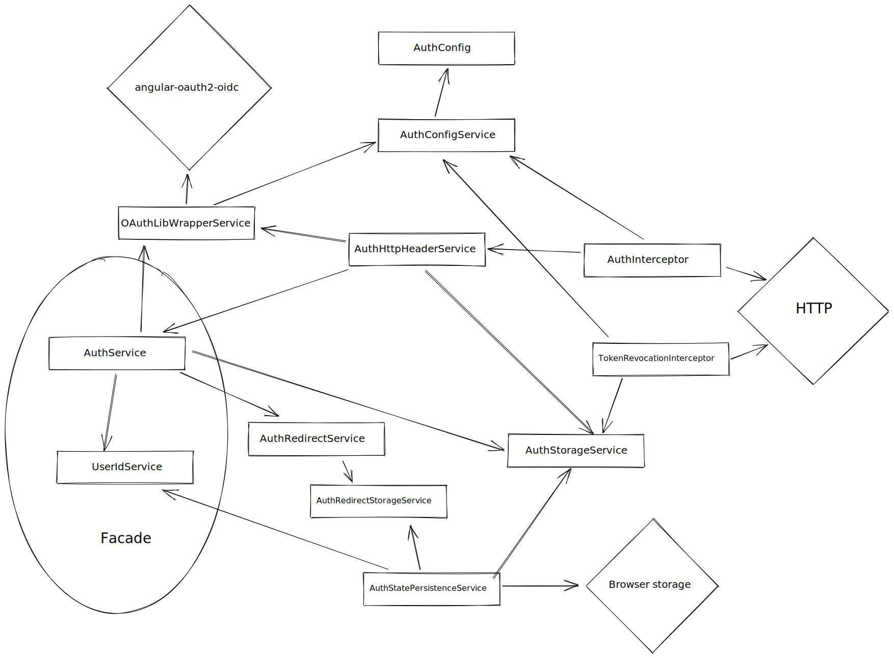

In Spartacus 3.0 we completely revamped the way we manage user session, handle tokens and perform authorization. This guide will help you understand how it works under the hood, how can you extend the underlying mechanism and how you should interact from outside with the auth module.

## Client authentication vs user authentication

Since the start of the spartacus project it included both client and user authentication which is pretty unusual for web applications. That's the requirement put on Spartacus by the OCC API.

There are couple of endpoints that work on behalf on not logged in user (eg. register, reset password, place order as guest, verify address) which require access token to be passed with the request. That access token needs to be retrieved by following Client Credentials Flow defined by OAuth specification. That's the part we define in spartacus as "Client authentication".

On the other hand we have user authentication which is used for requests perform on particular user resources. If you want to update you profile you need to be logged in. When you log in server confirms your credentials and returns back to the application access token. This token is then used for all requests on your account (eg. profile update, cart modifications, checkout).

With that explained we can present the first big change in session management in version 3.0. That is the separation of client authentication from user authentication. Before 3.0 client and user authentication code lived together in `AuthModule`. Interceptors, services, methods in facade, everything was mixed together in this module. After the refactor `AuthModule` still contains client and user authentication, but it's now accomplished by importing two modules: `UserAuthModule` and `ClientAuthModule`. Each module responsible for one type of authentication.

Why this change was important? Spartacus is build to support OCC by default, but it's not limited to it. OCC needs client credentials for some of the requests, but that is not common for the APIs. Separation of those modules makes use of different API simpler. When you don't need client authentication, instead of using `AuthModule` you can import only `UserAuthModule` and shave few kilobytes of your final bundle, by not including useless `ClientAuthModule`.

## User authentication

Most of the changes related to session management happened in `UserAuthModule`, so we will cover this module first.

Let's look how the `UserAuthModule` works under the hood.

There are a lot of things going on there, so let's follow it step by step.

This module is responsible for few things:

- perform authentication flow
- store tokens and user identifiers
- persist the tokens in browser storage
- add access token for user calls
- recover from API auth errors (eg. refresh token once access token expires)

Let's cover those things one by one.

### Authentication flow

Authenticating user is the main responsibility of this module. In previous Spartacus versions we provided supported for Resource Owner Password Flow OAuth flow with our handwritten code. However OAuth specifies more flows that can be used in web applications and we wanted to support that. To cover this requirement we decided to drop our code for Resource Owner Password Flow and rely on third party library `angular-oauth2-oidc` which was build for that purpose and is well tested and certified.
