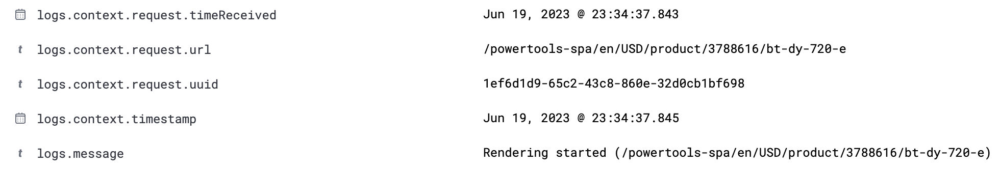

Server-side contextual logging enhances the debugging experience by letting you see the source of your log messages, as well as the context in the printed output. Furthermore, the content is formatted so that logs are easier to read, and easier to parse for monitoring tools. Server-side contextual logging also provides tools that allow you to customize the logging experience.

To benefit from all aspects of server-side contextual logging, you must do the following:

- Set `logger: true` in the `SsrOptimizationOptions` of your `server.ts` file. For more information, see [Enabling SSR Contextual Logging](#enabling-ssr-contextual-logging).
- Import `ErrorHandlingModule.forRoot()` in your storefront app, in the `spartacus.module.ts` file, for example. For more information, see [Enabling Contextual Logs In Error Handling](#enabling-contextual-logs-in-error-handling).
- Use the `LoggerService` instead of the native `console` object in your custom code. For more information, see [Using the LoggerService](#using-the-loggerservice).
- Ensure that any third-party libraries you are using can be configured to use the Spartacus `LoggerService`. For more information, see [LoggerService and Third-party Party Libraries](#loggerservice-and-third-party-party-libraries).

Without contextual logging, the following issues arise:

- Log messages are simply strings with little context about the rendered URL, making it difficult to connect the log message with the source of the log.
- The format of the log messages is not standardized, which can make it difficult to read and understand the messages.
- Log messages that span multiple lines are not formatted correctly, and each line is treated as a separate log in the monitoring tools, which further complicates the log viewing experience. For example, this can be the case for multiline stack traces of errors.

These issues make it difficult to read and understand log messages, particularly when log messages are coming from multiple parallel server-side-renderings and NodeJS servers. With server-side contextual logging, these issues are avoided because you can easily identify the source of your log messages, and also read them more easily.

Spartacus provides a default logger called `DefaultExpressServerLogger` that addresses common issues. This logger is used by default when server-side contextual logging is enabled. This logger takes care of proper formatting, and recognizes whether the output should be human-readable, or read by monitoring tools. The logger not only logs the messages, it also provides information about the related request that initiated the rendering process.

The following example shows how the logger creates logs in development mode by producing a multiline JSON output:

```json
{
  "message": "Rendering started (/powertools-spa/en/USD/product/3788616/bt-dy-720-e)",
  "context": {
    "timestamp": "2023-06-19T23:34:37.845Z", // timestamp of the log
    "request": {
      "url": "/powertools-spa/en/USD/product/3788616/bt-dy-720-e", // URL of the request
      "uuid": "1ef6d1d9-65c2-43c8-860e-32d0cb1bf698", // random UUID of the request
      "timeReceived": "2023-06-19T23:34:37.843Z" // timestamp when the request was received
   }
 }
}
```

The following is an example of a log created for production purposes. It is a single line of JSON that can be read by monitoring tools:

```text
{"message":"Rendering started (/powertools-spa/en/USD/product/3788616/bt-dy-720-e)","context":{"timestamp":"2023-06-19T23:34:37.845Z","request":{"url":"/powertools-spa/en/USD/product/3788616/bt-dy-720-e","uuid":"1ef6d1d9-65c2-43c8-860e-32d0cb1bf698","timeReceived":"2023-06-19T23:34:37.843Z"}}}
```

The following is an example of the log message in the monitoring tool:



## Enabling Server-Side Contextual Logging

To enable server-side contextual logging, in the `server.ts` file, set the `logger` option to `true` in the `SsrOptimizationOptions` that are passed to the `NgExpressEngineDecorator.get()` method. The following is an example:

```ts
import { ngExpressEngine as engine } from '@nguniversal/express-engine';
import { NgExpressEngineDecorator } from '@spartacus/setup/ssr';

[...]

const ngExpressEngine = NgExpressEngineDecorator.get(engine, {
  //add the logger flag here
  logger: true
});

[...]
```

With this configuration, your application uses the `DefaultExpressServerLogger` and provides request context for every logged message during server-side rendering.

## Enabling Contextual Logs in Error Handling

By default, Angular uses its own `ErrorHandler` to handle errors that occur during server-side rendering. However, this only prints errors to the console with a lack of context, and creates multiline messages that are not parsed correctly by monitoring tools. To improve error handling, Spartacus provides a `CxErrorHandler` that extends the default Angular `ErrorHandler` and uses `LoggerService` to log errors with the relevant context, when available.

To use `CxErrorHandler`, you need to import the `ErrorHandlingModule`. It is recommended that you import the `ErrorHandlingModule` in `spartacus.module.ts`, as shown in the following example:

```ts
import { ErrorHandlingModule } from '@spartacus/setup/ssr';

@NgModule({
  imports: [
    [...]
    ErrorHandlingModule.forRoot()
  ]
})
export class SpartacusModule {}
```

By importing `ErrorHandlingModule`, the `CxErrorHandler` then handles all errors that occur during server-side rendering, and these errors are logged with an appropriate context.

**Note:** Since user applications may contain their own implementations of `ErrorHandler`, the `CxErrorHandler` is not used by default when contextual logging is enabled. To enhance errors with the relevant context, it is recommended that you extend your error handler to use the `LoggerService`. For more information about the `LoggerService`, see [Using the LoggerService](#using-the-loggerservice).

## LoggerService and Third-party Party Libraries

To ensure that you have context and proper formatting for the logs that are output by third-party libraries in your application, it is recommended that you verify whether custom loggers can be provided, and that you use the `LoggerService` if possible. Otherwise, the logs from third-party libraries will be written in plain text, without the request's context and without proper formatting.

The `LoggerService` can be used not only to log messages that are added to your applications, but also to log messages that are added to those third-party libraries that are used in your project and that communicate by their state.

For example, Spartacus uses the `LoggerService` to display logs created by the `i18next` library. This was achieved by creating a compatible plugin with the `i18next` configuration and using the capabilities provided by the Spartacus logging service.

The following is an example of an implementation of the `i18next` plugin:

```ts
import { InjectionToken, inject } from '@angular/core';

import { LoggerModule } from 'i18next';
import { LoggerService } from '../../../logger';

export const I18NEXT_LOGGER_PLUGIN = new InjectionToken<LoggerModule>(
  'I18NEXT_LOGGER_PLUGIN',
  {
    providedIn: 'root',
    factory: () => {
      const logger = inject(LoggerService);
      return {
        type: 'logger',
        log: (args) => logger.log(...args),
        warn: (args) => logger.warn(...args),
        error: (args) => logger.error(...args),
      };
    },
  }
);
```

To improve debugging, it is worth checking which libraries in your applications generate logs, and whether the logging in these libraries can be extended with the logger provided by Spartacus.

For more information about the `LoggerService`, see [Using the LoggerService](#using-the-loggerservice).

## Customizing Server-Side Contextual Logging

You can customize server-side contextual logging, and even provide a custom logger in place of the default one.

To implement a custom logger, you create a class that implements the `ExpressServerLogger` interface. Alternatively, you can extend the `DefaultExpressServerLogger` class if you want to expand its existing functionality.

After the custom logger class is created, it can be passed to the `logger` property in the configuration object. The following is an example:

```ts
import { ngExpressEngine as engine } from '@nguniversal/express-engine';
import { NgExpressEngineDecorator } from '@spartacus/setup/ssr';
import { CustomExpressServerLogger } from './custom-express-server-logger';

[...]

const ngExpressEngine = NgExpressEngineDecorator.get(engine, {
  // pass custom logger here
  logger: new CustomExpressServerLogger()
});

[...]
```

The following is an example of a custom `ExpressServerLogger` implementation:

```ts
import { ExpressServerLogger } from '@spartacus/setup/ssr';

export class CustomExpressServerLogger implements ExpressServerLogger {

  //custom implementation of the `log` method
  log(message: string, context: ExpressServerLoggerContext): void {
    console.log({ message: `[My Custom LOG]: ${message}`, ...context });
  }

  // don't forget to also customize other methods, such as `debug`,`info`, `warn` and `error`
  [...]
}
```

Server-side contextual logging has been designed so that you can easily extend the logger output to provide the information that is relevant to you. The default logging functionality is also compatible with enterprise logging libraries that are used for logging in platform servers, such as [Winston](https://www.npmjs.com/package/winston) and [Pino](https://www.npmjs.com/package/pino), making it possible to add the features of these logging libraries to your system.

### Providing Additional Context to the Logs

In a real-world example, you may wish to extend the context of your logs with a custom header, such as `traceparent`, `content-type`, or `host`.

The following is an example of a custom logger implementation that extends the `DefaultExpressServerLogger` class and adds more functionality to the built-in `mapContext` method:

```ts
import { DefaultExpressServerLogger, ExpressServerLoggerContext } from '@spartacus/setup/ssr';

export class CustomExpressServerLogger extends DefaultExpressServerLogger {
  //extend output context with traceparent header
  override protected mapContext(context: ExpressServerLoggerContext): Record<string,any> {
     const outputContext = super.mapContext(context);
     return {
      ...outputContext,
      request: {
        ...outputContext?.request,
        traceparent: context.request?.get('traceparent')
      }
     }
  }
}
```

### Integrating with Third-Party Loggers

**Note:** The following example should not be treated as a recommendation for working with any specific third-party loggers. It is provided for demonstration purposes only.

The following is an example of how to integrate a third-party logger using the Pino library:

```ts
import { DefaultExpressServerLogger, ExpressServerLoggerContext } from '@spartacus/setup/ssr';
import { pino } from 'pino';

class CustomPinoLogger extends DefaultExpressServerLogger {
  protected logger = pino({
    // custom configuration of the Pino logger
  });

  // custom implementation of the `log` method
  log(message: string, context: ExpressServerLoggerContext): void {
    // Because the console.info() function is an alias for console.log(), we can use the same 'logger.info()' method for both log and info. For more information, see: https://nodejs.org/api/console.html#consoleinfodata-args
    this.logger.info(this.mapContext(context), message);
  }

  info(message: string, context: ExpressServerLoggerContext): void {
    this.logger.info(this.mapContext(context), message);
  }

  // don't forget to also customize other methods, such as `debug`, `warn` and `error`
}
```

The following is an example of what the logs created by the Pino library look like:

```text
{"level":30,"time":1687528211674,"pid":40850,"hostname":"SHMABCD1234567","options":{"concurrency":10,"timeout":3000,"forcedSsrTimeout":60000,"maxRenderTime":300000,"reuseCurrentRendering":true,"debug":false,"logger":"CustomLogger"},"msg":"[spartacus] SSR optimization engine initialized"}

{"level":30,"time":1687528382249,"pid":40850,"hostname":"SHMABCD1234567","request":{"url":"/electronics-spa/en/USD/","uuid":"446d5d59-0111-471e-b6f3-883617a9aaba","timeReceived":"2023-06-23T13:53:02.247Z"},"msg":"Rendering started (/electronics-spa/en/USD/)"}
```

**Note:** The Pino library [translates log levels to integer values](https://github.com/pinojs/pino/blob/master/docs/api.md#loggerlevel-string-gettersetter). For more information, see the [Pino landing page](https://www.npmjs.com/package/pino) on npm.

**Note:** The `DefaultExpressServerLogger` does not include any sensitive data in the logs. However, when using a custom logger, you must exercise caution and be careful about the data being provided. It is your responsibility to ensure that no sensitive information is being used or exposed.

## Using the LoggerService

You must use the `LoggerService` instead of the native `console` object to benefit from the enhanced logging capabilities provided in Spartacus.

The `DefaultExpressLoggerService` is used to handle any logs in Spartacus when using server-side rendering. It is injected and accessed through the `LoggerService`.

The following is an example of using the `LoggerService`:

```ts
import { LoggerService } from '@spartacus/core';

[...]

constructor(protected logger: LoggerService) {}

[...]

this.logger.log('Debug message');
```

### LoggerService Behavior in the Browser

By default, the `LoggerService` delegates messages to the native `console` object while preserving the default behavior of the console methods. This means that messages are displayed in the browser console with the same styling and behavior as the native `console` messages.

You can also customize the behavior of the `LoggerService` by providing your own implementation of the `LoggerService` interface.

### LoggerService Behavior in an SSR Context

For server-side rendering, Spartacus provides the `ExpressLoggerService` to the Angular context. This service extends the `LoggerService` and provides the `DefaultExpressServerLogger` for logging. Using this service guarantees that logs are properly formatted and contain the necessary context about the source of the log.

**Note:** By default, Spartacus does not output any sensitive data in the logs. However, if you include sensitive data in your log messages, it will be visible in the logs. Accordingly, you should ensure that no sensitive data is included in the log messages.
