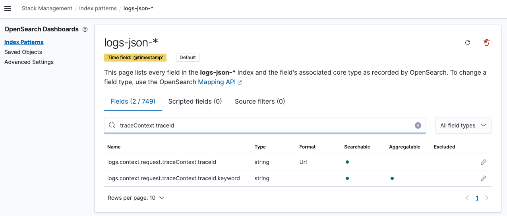

Standardized SSR logging enhances the debugging experience by letting you see the source of your log messages, as well as the context of the logs in the printed output. Furthermore, the content is formatted so that logs are easier to read, and easier to parse for monitoring tools. Standardized SSR logging also provides tools that allow you to customize the logging experience.

To benefit from all aspects of standardized SSR logging, you must do the following:

- In your `server.ts` file, set `logger: true` in the SSR options that are passed in the second argument of the `NgExpressEngineDecorator.get()` method. For more information, see [Enabling Standardized SSR Logging](#enabling-standardized-ssr-logging).
- Import `ErrorHandlingModule.forRoot()` in your storefront app, in the `spartacus.module.ts` file, for example. For more information, see [Enabling Standardized Logs In Error Handling](#enabling-standardized-logs-in-error-handling).
- Use the `LoggerService` instead of the native `console` object in your custom code. For more information, see [Using the LoggerService](#using-the-loggerservice).
- Ensure that any third-party libraries you are using can be configured to use the Spartacus `LoggerService`. For more information, see [Enabling Standardized Logs in Third-party Party Libraries](#enabling-standardized-logs-in-third-party-party-libraries).

Without standardized logging, the following issues arise:

- Log messages are simply strings with little context about the rendered URL, making it difficult to connect log messages with the source of the logs.
- The format of the log messages is not standardized, which can make it difficult to read and understand the messages.
- Log messages that span multiple lines are not formatted correctly, and each line is treated as a separate log in the monitoring tools, which further complicates the log viewing experience. For example, this can be the case for multiline stack traces of errors.

These issues make it difficult to read and understand log messages, particularly when log messages are coming from multiple parallel server-side-renderings and NodeJS servers. With standardized SSR logging, these issues are avoided because you can easily identify the source of your log messages, and also read them more easily.

Spartacus provides a default logger called `DefaultExpressServerLogger` that addresses common issues. This logger is used by default when standardized SSR logging is enabled. It takes care of proper formatting, and recognizes whether the output should be human-readable, or read by monitoring tools. The logger not only logs the messages, it also provides information about the related request that initiated the rendering process.

The following example shows how the logger creates logs in development mode by producing a multiline JSON output:

```json
{
  "message": "Rendering started (/powertools-spa/en/USD/product/3788616/bt-dy-720-e)",
  "context": {
    "timestamp": "2023-06-19T23:34:37.845Z", // timestamp of the log
    "request": {
      "url": "/powertools-spa/en/USD/product/3788616/bt-dy-720-e", // URL of the request
      "uuid": "1ef6d1d9-65c2-43c8-860e-32d0cb1bf698", // random UUID of the request
      "timeReceived": "2023-06-19T23:34:37.843Z" // timestamp when the request was received
    }
  }
}
```

The following is an example of a log created for production purposes. It is a single line of JSON that can be read by monitoring tools:

```text
{"message":"Rendering started (/powertools-spa/en/USD/product/3788616/bt-dy-720-e)","context":{"timestamp":"2023-06-19T23:34:37.845Z","request":{"url":"/powertools-spa/en/USD/product/3788616/bt-dy-720-e","uuid":"1ef6d1d9-65c2-43c8-860e-32d0cb1bf698","timeReceived":"2023-06-19T23:34:37.843Z"}}}
```

The following is an example of the log message in the monitoring tool:


## Enabling Standardized SSR Logging

To enable standardized SSR logging, in the `server.ts` file, set the `logger` option to `true` in the SSR options that are passed in the second argument of the `NgExpressEngineDecorator.get()` method. The following is an example:

```ts
import { ngExpressEngine as engine } from '@nguniversal/express-engine';
import { NgExpressEngineDecorator } from '@spartacus/setup/ssr';

[...]

const ngExpressEngine = NgExpressEngineDecorator.get(engine, {
  //add the logger flag here
  logger: true
});

[...]
```

With this configuration, your application uses the `DefaultExpressServerLogger` and provides request context for every logged message during server-side rendering.

## Enabling Standardized Logs in Error Handling

By default, Angular uses its own [`ErrorHandler`](https://angular.io/api/core/ErrorHandler) to handle errors that occur during server-side rendering. However, this only prints errors to the console with a lack of context, and creates multiline messages that are not parsed correctly by monitoring tools. To improve logging of errors, you have to import the Spartacus `ErrorHandlingModule.forRoot()` in `spartacus.module.ts`, as shown in the following example:

```ts
import { ErrorHandlingModule } from '@spartacus/setup/ssr';

@NgModule({
  imports: [
    [...]
    ErrorHandlingModule.forRoot()
  ]
})
export class SpartacusModule {}
```

Under the hood, the `ErrorHandlingModule.forRoot()` provides the Spartacus `CxErrorHandler`, which extends the default Angular `ErrorHandler`. As a result, all errors that occur during server-side rendering are passed to the `LoggerService`, and these errors are logged with an appropriate context. For more information about the `LoggerService`, see [Using the LoggerService](#using-the-loggerservice).

**Note:** If you already provide in your application a custom Angular `ErrorHandler`, importing `ErrorHandlingModule.forRoot()` might cause the Spartacus `CxErrorHandler` to overwrite (or be overwritten with) your own error handler (depending on the order of providers). In this case, it is recommended that your custom `ErrorHandler` should extend the Spartacus `CxErrorHandler` and use the `super.handleError()` method of the `CxErrorHandler`. This preserves the default Spartacus behavior, while also preserving the behavior of your custom `ErrorHandler`.

## Enabling Standardized Logs in Third-party Party Libraries

To ensure that you have context and proper formatting for the logs that are output by third-party libraries in your application, it is recommended that you verify whether custom loggers can be provided, and that you use the `LoggerService` if possible. Otherwise, the logs from third-party libraries will be written in plain text, without the request's context and without proper formatting.

For example, Spartacus depends on the third party library `i18next` and configures a custom [logger plugin](https://www.i18next.com/misc/creating-own-plugins#logger) for `i18next`, so `i18next` prints all its logs using the Spartacus `LoggerService`.

Similarly, you should check which other third party libraries are used in your application, and whether those libraries allow you to configure a custom logging strategy. If so, configure them to use the Spartacus `LoggerService` to ensure that the logs are written with proper context and formatting.

For more information about the `LoggerService`, see [Using the LoggerService](#using-the-loggerservice).

## Customizing Standardized SSR Logging

You can customize standardized SSR logging, and even provide a custom logger in place of the default one.

To implement a custom logger, you create a class that implements the `ExpressServerLogger` interface. It is recommended that you extend the `DefaultExpressServerLogger` class to expand its existing functionality.

After the custom logger class is created, it can be passed to the `logger` property in the configuration object. The following is an example:

```ts
import { ngExpressEngine as engine } from '@nguniversal/express-engine';
import { NgExpressEngineDecorator } from '@spartacus/setup/ssr';
import { CustomExpressServerLogger } from './custom-express-server-logger';

[...]

const ngExpressEngine = NgExpressEngineDecorator.get(engine, {
  // pass custom logger here
  logger: new CustomExpressServerLogger()
});

[...]
```

The following is an example of a custom `ExpressServerLogger` implementation:

```ts
import { ExpressServerLogger } from '@spartacus/setup/ssr';

export class CustomExpressServerLogger implements ExpressServerLogger {

  //custom implementation of the `log` method
  log(message: string, context: ExpressServerLoggerContext): void {
    console.log({ message: `[My Custom LOG]: ${message}`, ...context });
  }

  // don't forget to also customize other methods, such as `debug`,`info`, `warn` and `error`
  [...]
}
```

### Providing Additional Context to the Logs

In a real-world example, you may wish to extend the context of your logs with a custom header, such as `traceparent`, `content-type`, or `host`.

The following is an example of a custom logger implementation that extends the `DefaultExpressServerLogger` class and adds more functionality to the built-in `mapContext` method:

```ts
import {
  DefaultExpressServerLogger,
  ExpressServerLoggerContext,
} from '@spartacus/setup/ssr';

export class CustomExpressServerLogger extends DefaultExpressServerLogger {
  //extend output context with traceparent header
  protected override mapContext(
    context: ExpressServerLoggerContext
  ): Record<string, any> {
    const outputContext = super.mapContext(context);
    return {
      ...outputContext,
      request: {
        ...outputContext?.request,
        traceparent: context.request?.get('traceparent'),
      },
    };
  }
}
```

**Note:** The `DefaultExpressServerLogger` does not include any sensitive data in the logs. However, when implementing your custom logger, you must exercise caution and be careful about the data being provided. It is your responsibility to ensure that no sensitive information is being used or exposed.

### Integrating with Third-Party Loggers

**Note:** The following example should not be treated as a recommendation for working with any specific third-party logger. It is provided for demonstration purposes only.

The following is an example of how to integrate the third-party [Pino](https://getpino.io) logger:

```ts
import {
  DefaultExpressServerLogger,
  ExpressServerLoggerContext,
} from '@spartacus/setup/ssr';
import { pino } from 'pino';

class CustomPinoLogger extends DefaultExpressServerLogger {
  protected pino = pino({
    // custom configuration of the Pino logger
  });

  info(message: string, context: ExpressServerLoggerContext): void {
    this.pino.info(this.mapContext(context), message);
  }

  log(message: string, context: ExpressServerLoggerContext): void {
    // Because the console.log() function is an alias for console.info(), we can use the same 'logger.info()' method for both log and info. For more information, see: https://nodejs.org/api/console.html#consoleinfodata-args
    this.pino.info(this.mapContext(context), message);
  }

  warn(message: string, context: ExpressServerLoggerContext): void {
    this.pino.warn(this.mapContext(context), message);
  }

  error(message: string, context: ExpressServerLoggerContext): void {
    this.pino.error(this.mapContext(context), message);
  }

  debug(message: string, context: ExpressServerLoggerContext): void {
    this.pino.debug(this.mapContext(context), message);
  }
}
```

For more information about the API of the Pino library, see their [API documentation](https://getpino.io/#/docs/api).

The following is an example of what the logs created by the Pino library look like:

```text
{"level":30,"time":1687528211674,"pid":40850,"hostname":"SHMABCD1234567","options":{"concurrency":10,"timeout":3000,"forcedSsrTimeout":60000,"maxRenderTime":300000,"reuseCurrentRendering":true,"debug":false,"logger":"CustomLogger"},"msg":"[spartacus] SSR optimization engine initialized"}

{"level":30,"time":1687528382249,"pid":40850,"hostname":"SHMABCD1234567","request":{"url":"/electronics-spa/en/USD/","uuid":"446d5d59-0111-471e-b6f3-883617a9aaba","timeReceived":"2023-06-23T13:53:02.247Z"},"msg":"Rendering started (/electronics-spa/en/USD/)"}
```

**Note:** The Pino library [translates log levels to integer values](https://github.com/pinojs/pino/blob/master/docs/api.md#loggerlevel-string-gettersetter).

## Using the LoggerService

In your custom code, you must use the `LoggerService` instead of the native `console` object to benefit from the enhanced logging functionality provided in Spartacus.

The following is an example of using the `LoggerService`:

```ts
import { LoggerService } from '@spartacus/core';

[...]

constructor(protected logger: LoggerService) {}

[...]

this.logger.debug('Debug message');
```

### LoggerService Behavior in the Browser

By default, the `LoggerService` delegates messages to the native `console` object while preserving the default behavior of the `console` methods. This means that messages are displayed in the browser console with the same styling and behavior as the native `console` messages.

You can also customize the behavior of the `LoggerService` by providing your own implementation of the `LoggerService`.

### LoggerService Behavior in an SSR Context

For server-side rendering, Spartacus overwrites the `LoggerService` with the `ExpressLoggerService` by default, which uses the `DefaultExpressServerLogger` for logging under the hood.

## Trace Context

Spartacus offers support for the [W3C Trace Context](https://www.w3.org/TR/trace-context/) specification in addition to standardized SSR logging. With its built-in parser, you can extract trace context information from incoming requests and include it in the logs generated during server-side rendering. This enhancement provides new opportunities for seamlessly linking logs with requests' traces. For instance now it's possible to link logs displayed in the tools like OpenSearch to the distributed trace presentation tools like Dynatrace.

**Note:** Utilizing the Trace Context standard introduces potential security risks. Vendors using the traceparent header must follow best practices for parsing headers that could be malicious to mitigate the risk of buffer overflow and HTML injection attacks. It's important to be aware that traceparent may expose sensitive information, potentially facilitating more significant attacks, and precautions should be taken accordingly. Enabling distributed tracing without adequate safeguards can leave systems vulnerable to denial-of-service attacks, so tracing vendors should implement protective measures, such as handling authenticated and unauthenticated requests differently and implementing rate limiters. For more details, please refer to [W3C Trace Context - Security Considerations](https://www.w3.org/TR/trace-context/#security-considerations).
While the mentioned risks are not specific to Spartacus itself, if you have concerns regarding the security of the traceparent header, you may want to consider creating your own ExpressServerLogger implementation that does not include traceContext values in the logs.

### Attaching Trace Context to the logs

**Note:** The provided examples have been verified on SAP Commerce Cloud, which employs Dynatrace as its default observability platform. Nonetheless, since Trace Context adheres to W3C standards, these principles should be applicable to other comparable tools as well.

The `traceContext` property will be automatically included in the logs if the incoming request contains the `traceparent`` header. This seamless integration simplifies the process of capturing trace context information.

The following is an example of a traceparent header:
```text
traceparent: 00-0af7651916cd43dd8448eb211c80319c-b7ad6b7169203331-01
```

The following is an example of a log that contains the `traceContext` property:
```json
{
  "message": "Rendering completed (/electronics-spa/en/USD/)",
  "context": {
    "timestamp": "2023-09-13T12:14:21.377Z",
    "request": {
      "url": "/electronics-spa/en/USD/",
      "uuid": "a076a5ba-7889-4c19-840e-395e89fde4b5",
      "timeReceived": "2023-09-13T12:14:13.450Z",
      "traceContext": {
        "version": "00",
        "traceId": "0af7651916cd43dd8448eb211c80319c",
        "parentId": "b7ad6b7169203331",
        "traceFlags": "01"
      }
    }
  }
}
```

If the traceContext is not appearing in the logs, there are several potential reasons for this:
- **W3C Trace Context Not Enabled in Dynatrace:** Ensure that W3C Trace Context is enabled in your Dynatrace configuration. Without proper configuration, trace context information may not be collected.
- **Middleware Filtering:** Check if any middleware or components in your system are filtering out the `traceparent` header. If it's being removed or modified before reaching your application, the trace context information may not be captured.
- **Invalid `traceparent` Header:** Verify that the traceparent header value in the incoming request is valid and conforms to the W3C Trace Context specification. An invalid header may not be recognized and processed correctly.

Addressing these potential issues is essential to ensure the correct inclusion of the traceContext in your logs. The built-in parser, designed to extract the trace context from the `traceparent header``, satisfies all security requirements specified in the W3C Trace Context standard. It meticulously examines each component of the header to verify its proper format. If the header is found to be invalid, the traceContext property will not be appended to the logs. Additionally, the parser will generate a log message that can be useful for debugging purposes.

The following is an example of such a log:

```json
{
  "message": "Traceparent header has invalid length: 18. Expected 55 characters.",
  "context": {
    "timestamp": "2023-09-13T12:14:21.377Z",
    "request": {
      "url": "/electronics-spa/en/USD/"
    }
  }
}
```

Depending on the error ocurred during the parser, following error messages may be generated:
- `Traceparent header has invalid length: ${traceparent.length}. Expected 55 characters.` - the `traceparent` header has invalid length
- `Traceparent header has invalid format.` - the `traceparent` header has invalid format. To learn more, see [W3C Trace Context - Traceparent Header](https://www.w3.org/TR/trace-context/#traceparent-header)

### Connecting Logs to Distributed Traces

**Note:** These steps have been verified on SAP Commerce Cloud, where OpenSearch Dashboards is the default monitoring tool. Please be aware that the steps described here may vary when using other monitoring tools.

All logs generated by Spartacus can be seen in OpenSearch Dashboards monitoring tool.
The following is an example of a log presented the monitoring tool:


OpenSearch enables the formatting of fields as hyperlinks, and this section outlines the steps for configuring links that direct you to the Dynatrace distributed trace view.

To begin, navigate to the main menu and proceed to the "Stack Management" section. Within "Stack Management," choose "Index Patterns" from the available left navigation options.


Next, select the pre-defined index pattern that corresponds to the log messages generated by your application. Locate the index where your application's logs are displayed.


Once we selected an index pattern, the corresponding field list is shown (see screenshot below). We can filter the fields by name. We use this functionality to search for the field “traceId”. If the field is not found, try refreshing the index pattern with the little reload button on the top right in the screenshot. We can edit the field configuration by clicking on the pencil symbol in the table.



After selecting an index pattern, the associated field list will be displayed (as shown in the screenshot below). You can filter the fields by name, and in this case, you should use this feature to search for the "traceId" field. If you can't find the "traceId" field, try refreshing the index pattern by clicking the small reload button located at the top right corner in the screenshot. To edit the field configuration, simply click on the pencil symbol within the table.


Once you've saved the field configuration, you can return to the log view. You will notice that the "traceId" field has been transformed into a hyperlink. Clicking on this link will now direct you to the distributed trace view.


