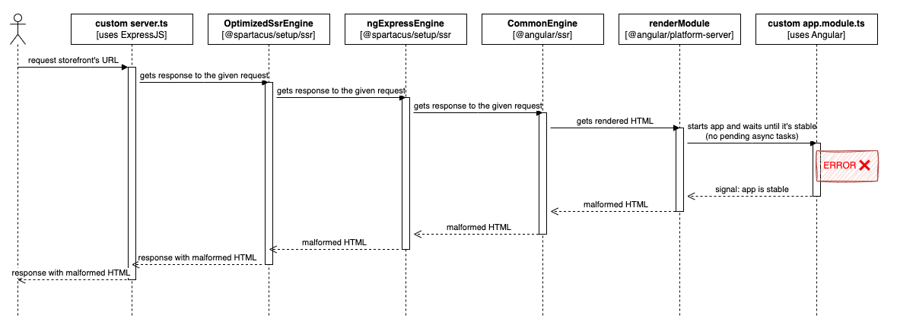
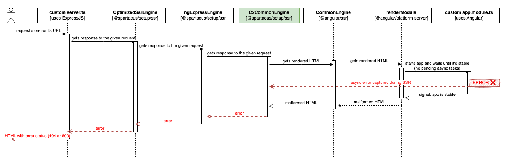
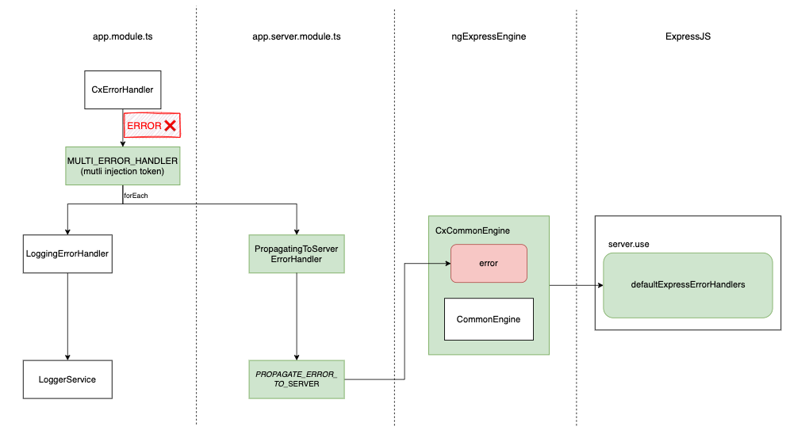
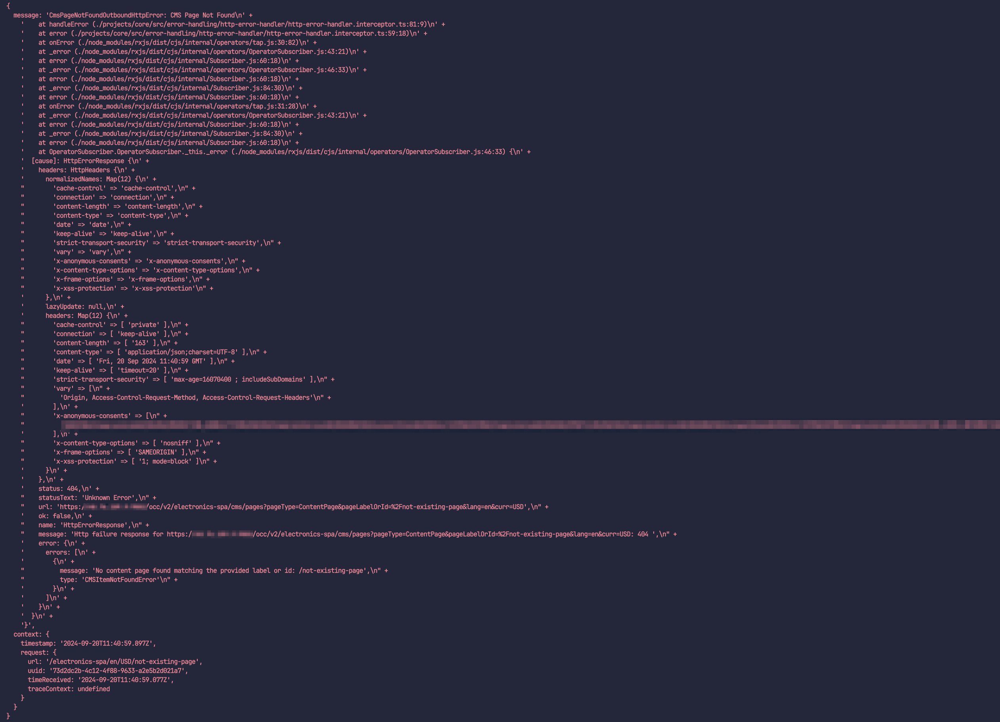
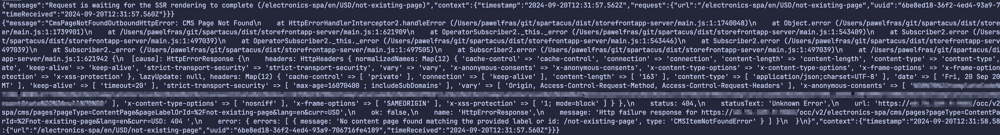

## Overview

Server-side rendering (SSR) error handling in Spartacus provides functionality that is missing from the Angular engine's error handling when pages are rendered on the server. SSR error handling ensures that your Spartacus application reacts to encountered errors by providing a default set of tools to handle them. It also provides the option to customize the experience. SSR error handling is essential for the SEO of your storefront pages, and for the overall user experience.

For more information about the Angular engine's missing error handling functionality, see [Angular Github issue #33642](https://github.com/angular/angular/issues/33642).

**Note:** By default, Angular SSR ignores all errors that occur during rendering except for the following edge cases:

- errors in `APP_INITIALIZER` hooks
- synchronous errors during the bootstrap of the root component

Starting with version 2211.29, newly created Spartacus apps have SSR error handling enabled by default, which addresses the limitations of the out-of-the-box Angular SSR behavior.

If your Spartacus app was created before version 2211.29, to benefit from all aspects of SSR error handling, you must do the following:

- Enable the `propagateErrorsToServer` feature toggle to start propagating the errors caught during server-side rendering to the ExpressJS server, where eventually they will be properly handled. For more information, see [Propagating Errors To The Server](#propagating-errors-to-the-server).
- Enable the `ssrStrictErrorHandlingForHttpAndNgrx` feature toggle to seal the Angular application from the asynchronous errors that occur in the NgRx flow and from HTTP calls during the rendering process. For more information, see [Strict Error Handling for HTTP And NgRx](#strict-error-handling-in-angular-for-http-and-ngrx).
- Enable `ssrFeatureToggle.avoidCachingErrors` in `SsrOptimizationOptions` to not cache any pages where an error occurred during rendering. For more information, see [Cache management and error handling](#cache-management-and-error-handling).
- Use the `defaultExpressErrorHandlers` middleware in `server.ts` to handle errors in ExpressJS. For more information, see [Using Default ExpressJS Error Handlers](#using-default-expressjs-error-handlers).
- Ensure that the `provideServer()` config function is provided in the `app.server.module.ts` file. It contains elements that are required for SSR error handling to work properly.

**Note:** SSR error handling is introduced in Spartacus 2211.29. For new applications, the feature is enabled by default. For older applications, the feature is disabled by default, but you can enable it using the feature toggles mentioned just above. After a certain period, the feature toggles will be enabled by default in newer versions of Spartacus, but you still may need to perform some steps manually to fully enable the functionality of SSR error handling.

**Note:** Together with SSR error handling, Spartacus provides `ssrFeatureToggles` that allow you to enable or disable specific features for the `OptimizedSsrEngine`. For more information, see [SSR Feature Toggles](TODO: add link to page when is ready).

Without SSR error handling, the following issues arise:

- With Angular's default SSR behavior (which is used under-the-hood by Spartacus), when an asynchronous error occurs during rendering (for example, with an API call, or a runtime error in the code), the rendering process does not stop, and it eventually returns potentially malformed HTML to the client, along with an incorrect `200` HTTP status code. This can lead to client-side errors and the page not being rendered correctly.
- When a customer enters a URL that unknown to the application, Spartacus returns an error page, but with a misleading `200` status.

Both scenarios can drastically affect the SEO of storefront pages because the wrong status code sent in the response to the client can lead to malformed pages and unknown URLs being indexing by Google.

The following is a sequence diagram of an incoming SSR request rendering an out-of-the-box Angular application, with the Spartacus `OptimizedSsrEngine` included, but without SSR error handling enabled. It shows how an asynchronous error that occurs during rendering is ignored, and as a result, malformed HTML is returned to the client:



To solve this issue, Spartacus provides `CxCommonEngine`, which is a wrapper for `CommonEngine` that allows it to react to asynchronous errors that occur during SSR. With this solution, it is possible to return an error with the appropriate status code, instead of the rendered HTML that is potentially malformed.

The following is a sequence diagram that shows how the path now looks, from the incoming request to the error response, with the attached `CxCommonEngine`:



To propagate errors from the Angular app to ExpressJS, Spartacus introduces a contract between the Angular app and ExpressJS.
The following diagram shows the connections between the elements of the contract, with arrows representing the flow of data or error:



**Note:** There is a difference between the two types of error handlers in the two different layers, as follows:

- The Angular `ErrorHandler` class receives errors that happen during app rendering by Angular (on the server side). Spartacus provides a custom version of this (the `CxErrorHandler`), which propagates these errors to the next layer (that is, ExpressJS).
- Express error handler functions receive errors propagated from app rendering by Angular. These are responsible for sending an appropriate HTTP status code, as well as the HTML content, to the client of the server-side rendering.

## Propagating Errors to the Server

To propagate errors to the ExpressJS server that were caught during server-side rendering, Spartacus uses the `CxErrorHandler` (a custom version of the Angular `ErrorHandler` class) to hand over the error to the multi-provided error handlers, one of which is the `PropagatingToServerErrorHandler`. Another is the `LoggingErrorHandler`, which prints the error message to the console.

For more detailed information about these error handlers, see [Multi Error Handlers](#multi-error-handlers) and [About the CxCommonEngine](#about-the-cxcommonengine).

**Note:** If you are providing a custom Angular `ErrorHandler`, extend the `CxErrorHandler` from Spartacus to ensure your custom `ErrorHandler` takes advantage of SSR error handling.

## About the CxCommonEngine

The [`CxCommonEngine`](https://github.com/SAP/spartacus/blob/develop/core-libs/setup/ssr/engine/cx-common-engine.ts) is a core element of SSR error handling. It is a wrapper for Angular's [CommonEngine](https://github.com/angular/angular-cli/blob/e56adb062b86ecc538346412856bba57a8f378cf/packages/angular/ssr/src/common-engine.ts#L56) that allows it to react to asynchronous errors that occur during SSR.

As a result, it is possible to react to propagated errors, and your ExpressJS application will receive an error instead of malformed HTML.

## Multi Error Handlers

Spartacus offers to option to provide multiple implementations of the Angular `ErrorHandler` class that can react to errors caught during server-side rendering. The errors can be provided using the `MULTI_ERROR_HANDLER` token. Each captured error is handled, one by one, by the Spartacus `CxErrorHandler`.

The default multi-provided error handlers are the following:

- `LoggingErrorHandler`, which logs errors using the `LoggerService`
- `PropagatingToServerErrorHandler`, which is specifically for SSR error handling, and which passes errors to the `CxCommonEngine` with the help of the `PROPAGATE_ERROR_TO_SERVER` injection token.

To create a custom multi-provided error handler, you need to implement a `MultiErrorHandler` interface, and provide the handler in a module.

The following is an example of how to implement the `MultiErrorHandler` interface:

```ts
@Injectable({
  providedIn: 'root',
})
export class MyMultiErrorHandler implements MultiErrorHandler {
  handleError(error: unknown): void {
    /* custom error handling logic */
  }
}
```

And the following is an example of how to provide the handler in a module:

```ts
@NgModule({
  providers: [
    {
      provide: MULTI_ERROR_HANDLER,
      useClass: MyMultiErrorHandler,
      multi: true,
    },
  ],
})
export class MyModule {}
```

**Note:** All multi-provided error handlers are run. The order of running them is same as the order they are provided.

## Using Default ExpressJS Error Handlers

To handle errors in ExpressJS that were caught during server-side rendering, Spartacus provides a set of default error handlers that can be used in the `server.ts` file. The following is an example:

```ts
/* ... */
export function app(): express.Express {
  const server = express();
  const distFolder = join(process.cwd(), 'dist/my-app/browser');
  const indexHtml = existsSync(join(distFolder, 'index.original.html'))
    ? 'index.original.html'
    : 'index.html';
  const indexHtmlContent = readFileSync(join(distFolder, indexHtml), 'utf8');

  /* ... */

  server.use(defaultExpressErrorHandlers(indexHtmlContent));

  return server;
}
```

The [`defaultExpressErrorHandlers`](https://github.com/SAP/spartacus/blob/develop/core-libs/setup/ssr/error-handling/express-error-handlers/express-error-handlers.ts) function takes the `documentContent` as an argument, which is the content of the application's `index.html` file. The function returns an error handler that drives a "Fallback to CSR" strategy and sends the `documentContent` with the proper status code, based on the error type. By default, the function returns a `404` status code for the `CmsPageNotFoundOutboundHttpError`, and a `500` status code for other errors.

The benefits of this approach are the following:

- Spartacus sends a semantic HTTP response code, such as 404 or 500, so that search engines do not index pages with these error codes, nor do they attempt to revisit the page in the future.
- Spartacus sends HTML content from the "CSR fallback", which increases the chance that users will see the correct content for the page, based on the client-side rendering, if the error that happened in SSR is not also repeated in CSR.

### Customizing ExpressJS Error Handlers

The final error handling takes place in the ExpressJS middleware, and as a result, it can be customized to fit the specific needs of your application.

The following is an example of implementing custom error handler middleware in `server.ts` to return a custom error page:

```ts
export const customErrorPageErrorHandlers: ErrorRequestHandler = async (
  err,
  _req,
  res,
  _next
) => {
  const statusCode =
    err instanceof CmsPageNotFoundOutboundHttpError
      ? HttpResponseStatus.NOT_FOUND
      : HttpResponseStatus.INTERNAL_SERVER_ERROR;

  const html = `
    <!DOCTYPE html>
    <html lang="en">
      <head>
        <meta charset="UTF-8" />
        <meta http-equiv="X-UA-Compatible" content="IE=edge" />
        <meta name="viewport" content="width=device-width, initial-scale=1.0" />
        <title>ERROR</title>
      </head>
      <body>
        <h1>${
          statusCode === HttpResponseStatus.NOT_FOUND
            ? 'Oups! Page not found (404)'
            : 'Internal Server Error (500)'
        }</h1>
      </body>
    </html>
    `;
  res.status(statusCode).send(html);
};
```

To use the custom error handler, replace the `defaultExpressErrorHandlers` with the `customErrorPageErrorHandlers` in the `server.ts` file, as shown in the following example:

```ts
import { APP_BASE_HREF } from '@angular/common';
import {
  ngExpressEngine as engine,
} from '@spartacus/setup/ssr';
import { customErrorPageErrorHandlers } from './custom-error-handler';

import express from 'express';
import { existsSync, readFileSync } from 'node:fs';
import { join } from 'path';

export function app(): express.Express {
  const server = express();
  const distFolder = join(process.cwd(), 'dist/my-app/browser');
  const indexHtml = existsSync(join(distFolder, 'index.original.html'))
    ? join(distFolder, 'index.original.html')
    : join(distFolder, 'index.html');
  const indexHtmlContent = readFileSync(indexHtml, 'utf-8');

  /* ... */

  //server.use(defaultExpressErrorHandlers(indexHtmlContent)); <-- replace with your custom error handler
  server.use(customErrorPageErrorHandlers);

  return server;
}
```

If you find the functionality of `defaultExpressErrorHandlers` sufficient, but you want a customize how one type of error is handled, you can provide a custom error handler before the `defaultExpressErrorHandlers`. Ensure that you call `next(err)` in the custom error handler to let the `defaultExpressErrorHandlers` take care of errors that are not handled by the custom handler.

The following is an example of how to provide a custom error handler for `CmsPageNotFoundOutboundHttpError` in a `custom-error-handler.ts` file:

```ts
export const customCmsPageNotFoundErrorHandler: ErrorRequestHandler = async (
  err,
  _req,
  res,
  next
) => {
  const errorPage = /*...*/;
  if (err instanceof CmsPageNotFoundOutboundHttpError) {
    res.status(HttpResponseStatus.NOT_FOUND).send(errorPage);
  } else {
    next(err);
  }
};
```

The following is an example of the corresponding implementation in `server.ts`:

```ts
import { APP_BASE_HREF } from '@angular/common';
import {
  ngExpressEngine as engine,
} from '@spartacus/setup/ssr';
import { customErrorPageErrorHandlers } from './custom-error-handler';

import express from 'express';
import { existsSync, readFileSync } from 'node:fs';
import { join } from 'path';

export function app(): express.Express {
  const server = express();
  const distFolder = join(process.cwd(), 'dist/my-app/browser');
  const indexHtml = existsSync(join(distFolder, 'index.original.html'))
    ? join(distFolder, 'index.original.html')
    : join(distFolder, 'index.html');
  const indexHtmlContent = readFileSync(indexHtml, 'utf-8');

  /* ... */

  server.use(customErrorPageErrorHandlers); // <-- custom error handler for 404 provided before the default error handlers
  server.use(defaultExpressErrorHandlers(indexHtmlContent));

  return server;
}
```

## Strict Error Handling in Angular for HTTP and NgRx

 To seal the Angular application from asynchronous errors that occur in the NgRx flow, and from HTTP calls to the back end during the rendering process, Spartacus provides a set of tools to handle them, as described in the following sections.

### Handling HTTP Errors

To handle HTTP errors, Spartacus provides `HttpErrorHandlerInterceptor`, which catches HTTP errors and forwards them to the `CxErrorHandler`. By default, the interceptor helps to distinguish two types of errors by wrapping them with custom error classes before passing them to the `CxErrorHandler`. Those classes are the following:

- An `OutboundHttpError` represents an outbound HTTP error that occurs when communicating with the back end.
- A `CmsPageNotFoundOutboundHttpError` represents an outbound HTTP error that is specific to a CMS page not found. This error extends the base `OutboundHttpError` class.

When these kinds of semantic errors are propagated to ExpressJS and handled there by the `defaultExpressErrorHandlers` middleware, it can distinguish the errors and return an appropriate status code to the client (such as `404` or `500`).

**Note:** Ensure that your custom Angular HTTP interceptors are provided after `HttpErrorHandlerInterceptor`, so that they are the next to run in the sequence. If they catch any error, make sure to rethrow the error downstream to the next interceptors. Otherwise, the Spartacus `HttpErrorHandlerInterceptor` will not capture the error, and as result, it will not be able to propagate the error to the ExpressJS layer, which in turn will prevent sending the appropriate HTTP error status code to the client of the server-side rendering.  

The Spartacus `HttpErrorHandlerInterceptor` treats all outbound HTTP as a reason to make SSR fail.

However, if this assumption is not true for your application, you can customize it by over-providing the Spartacus `HttpErrorHandlerInterceptor`. This might be useful in one of the following cases:

- When you do not want certain back-end HTTP errors to make SSR fail (for example, when certain HTTP errors from the back end are considered unimportant for the final HTML result of the server-side rendering).
- When you want certain back-end HTTP success responses to be treated as errors that making SSR fail (for example, when the back end responds with a status `200` and a custom payload indicating an error, such as `{ "ok": false, ... }`)

### Handling NgRx Errors

Spartacus treats any NgRx action containing the `error` property as a reason for SSR to fail. To handle them, Spartacus provides elements of the NgRx flow to help catch the errors and forward them to the `CxErrorHandler`, as follows:

- `ErrorActionService` filters all dispatched NgRx Actions with the `error` property, and forwards such errors to the `CxErrorHandler`.
- `ErrorAction` is an interface of an NgRx action with an `error`  property. This interface is used in `ErrorActionService`.

The following is an example of how to implement the `ErrorAction` interface in your custom failure action:

```ts
export class MyActionFail implements ErrorAction {
  readonly type = MY_ACTION_FAIL;
  public error: Object;
  constructor(public payload: Object) {
    this.error = payload;
  }
}
```

Ensure that all your custom NgRx Actions of type `Fail` contain the `error` property.

**Note:** If, in your case, some exceptional NgRx actions with the `error` property should not make SSR fail, you can customize the behavior by over-providing the Spartacus `ErrorActionService`.

## Avoiding Use of the RESPONSE Token for Setting Status Codes

Before Spartacus version 2211.29, one of the ways to react to handled errors was to manually inject a `RESPONSE` token in the code and call `this.response.set(<custom-status>)`. If you have previously used this approach, you should no longer do so because it is no longer guaranteed to work correctly with the new contract between the Angular app and ExpressJS. If there is a need to handle any custom error, it can be done by injecting `ErrorHandler` and calling `this.errorHandler.handleError(<custom-error>)` instead. The following is an example:

```ts
@Injectable()
export class MyService {
  const errorHandler = inject(ErrorHandler);

  myMethod() {
    try {
      // some code that may throw an error
    } catch (error) {
      this.errorHandler.handleError(error);
    }
  }
}
```

## Cache Management and Error Handling

It is not recommended to cache pages where an error occurred during rendering, for the following reasons:

- **Serving Incorrect Content:** If a page with rendering errors is cached, subsequent requests to that page will receive the erroneous content. This can lead to confusion and a poor user experience because users might see incomplete or broken pages.
- **Difficulty in Debugging:** When errors are cached, it becomes harder to identify and debug issues. Developers might not be aware that users are receiving erroneous content, which makes it challenging to diagnose and fix the underlying problem.
- **Performance Degradation:** While caching is generally used to improve performance, caching pages with errors can have the opposite effect. Users might repeatedly encounter the same error, leading to frustration and potentially increasing the load on support channels.

To avoid caching such pages, Spartacus provides changes to the `RenderingCache` class, which is the part of the `OptimizedSsrEngine`, and which is responsible for caching renders. From now, the caching strategy can be controlled by the new `shouldCacheRenderingResult` property, which is part of the `SsrOptimizationOptions`:

```ts
shouldCacheRenderingResult?: ({
    options,
    entry,
  }: {
    options: SsrOptimizationOptions;
    entry: Pick<RenderingEntry, 'err' | 'html'>;
  }) => boolean;
```

By default, all HTML rendering results are cached. Also, all errors are cached by default, unless the separate `ssrFeatureToggles.avoidCachingErrors` option is enabled.

If needed, the caching strategy can be easily customized by providing its own function.

## Error Handling and Logging

All errors caught during server-side rendering are logged using the `LoggerService` provided by Spartacus, which means they are presented in a standardized way.

The following is an example of developer-friendly multiline JSON output in development mode:



The following is an example of single line JSON output in production mode, which is seamlessly parsed by monitoring tools:



Apart from that, the `OptimizedSsrEngine` indicates if a request is resolved with the server-side rendering error.

The following is an example of the log message if an error occurred during the rendering process:


These kinds of logs are crucial for monitoring and debugging purposes because they provide information about the error and the related request.
