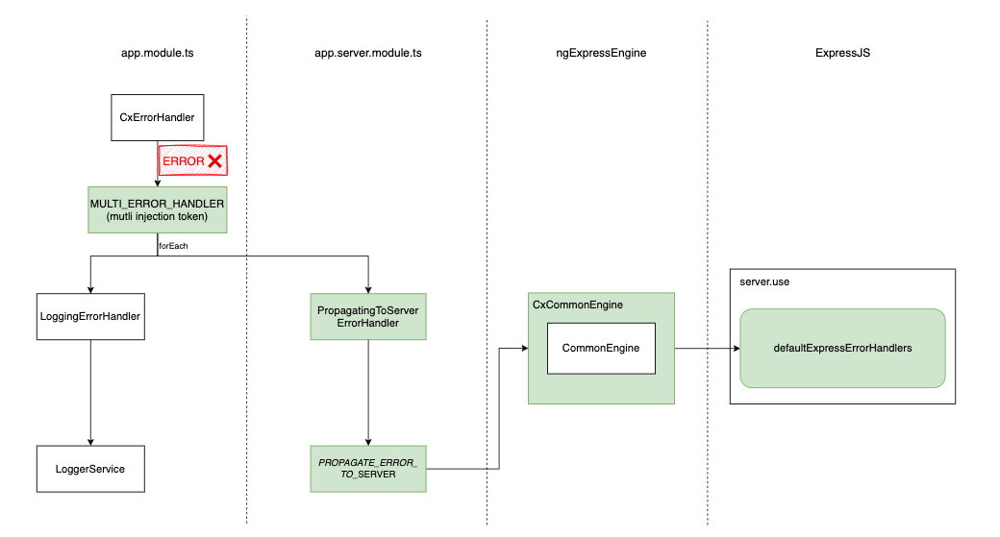

SSR Error Handling functionality provided the missing behavior to how Angular engine handles errors during rendering pages on the server. It ensures the Spartacus application reacts on the encountered errors by providing default set of tools to handle them and, at the same time, giving a possibility to customize the experience. This feature is crucial for the SEO of the page and the overall UX.

**Note:** Angular SSR by default doesn't ignore an error only if occurred in the APP_INITIALIZER or synchronous bootstrap of the root component.

To benefit from all aspects of SSR error handling, you must do the following: 
- Enable `propagateErrorsToServer` feature toggle to start propagating to the ExpressJS server the errors caught during server-side rendering, where eventually they will be properly handled. For more information, see [Propagating Errors To The Server](#propagating-errors-to-the-server).
- Enable `ssrStrictErrorHandlingForHttpAndNgrx` feature toggle to seal the Angular application from the asynchronous errors that occur in NgRx flow and HTTP calls during the rendering process. For more information, see [Strict Error Handling for HTTP And NgRx](#strict-error-handling-for-http-and-ngrx).
- Enable `ssrFeatureToggle.avoidCachingErrors` in `SsrOptimizationOptions` to not cache pages for which error occurred during rendering. For more information, see [Cache management and error handling](#cache-management-and-error-handling).
- use `defaultExpressErrorHandlers` middleware in `server.ts` to handle errors in ExpressJS. For more information, see [Using Default ExpressJS Error Handlers](#using-default-expressjs-error-handlers).
- make sure that `provideServer()` config function is provided in the `app.server.module.ts` file. It contains elements required for SSR Error Handling to work properly.

**Note:** The SSR Error Handling is available starting from Spartacus 2211.29. For new application, the feature is enabled fy default. For migrated application. the feature is disabled by default and can be enabled by using mentioned feature toggles. After expiration of the feature toggle period, the feature will be enabled by default.
**Note:** Together with SSR Error Handling, Spartacus provides `ssrFeatureToggles` that allow you to enable or disable features specific for `OptimizedSsrEngine`. For more information, see [SSR Feature Toggles](TODO: add link to page when is read).

Without SSR Error Handling, the following issues arise:

- with the default Angular SSR behavior (used under the hood of Spartacus SSR), when the asynchronous error occurs during the rendering (e.g. API call, runtime error in the code), rendering process will not stop and eventually returns possibly malformed HTML to the client with the improper HTTP status code `200`. This can lead to the client-side errors and the page not being rendered correctly.
- when customer enters the URL unknown for the application, Spartacus returns an error page, but with misleading status `200`.

Both scenarios may drastically affect the SEO of the page due to fact the wrong status code in the response to the client might lead to indexing by Google the malformed pages and unknown URLs.

See below the sequence diagram of rendering the Angular app for an incoming request in SSR, with Spartacus OptimizedSsrEngine included. It shows how an asynchronous error happening during the rendering is ignored and a malformed HTML is returned to a client:


To solve the issues, Spartacus provided CxCommonEngine - a wrapper for CommonEngine which allows to react on asynchronous errors that occurred during SSR. Thanks to this, it is possible to return an error with the appropriate status code instead of the rendered HTML which is potentially malformed.

See below the sequence diagrams showing how the path from the incoming request to the error response looks with the attached CxCommonEngine:


To propagate errors from the Angular app to ExpressJS, Spartacus introduce a new contract between the Angular app and ExpressJS.
See below the diagram showing the connections between elements of the contract:




## Propagating errors to the server

To propagate errors caught during server-side rendering to the ExpressJS server, the `CxErrorHandler` provided together with `Standardized SSR logging` feature has been extended. Now the error handler acts differently based on the platform it is running on thanks to multi error handlers:
- `LoggingErrorHandler`, which logs the error using `LoggerService`;
- `PropagatingToServerErrorHandler`, specially for SSR Error Handling purposes, which passes the error to the `CxCommonEngine` thanks to `PROPAGATE_ERROR_TO_SERVER` injection token. For more, see [CxCommonEngine](#cx-common-engine).

To read more about Multi error handlers, see [Multi error handlers](#multi-error-handlers).

**Note:** If you're providing your own error handler, extend the `CxErrorHandler` from Spartacus to ensure benefits from the SSR Error Handling.

## CxCommonEngine

`CxCommonEngine` is a core element of SSR Error Handling. It is a wrapper for Angular's [CommonEngine](https://github.com/angular/angular-cli/blob/e56adb062b86ecc538346412856bba57a8f378cf/packages/angular/ssr/src/common-engine.ts#L56) that allows to react on asynchronous errors that occurred during SSR. 
The following is an implementation of the `CxCommonEngine`:
```ts
export class CxCommonEngine extends CommonEngine {
  constructor(options?: CommonEngineOptions) {
    super(options);
  }

  /**
   * If an error is populated from the rendered applications
   * (via `PROPAGATE_ERROR_TO_SERVER` callback), then such an error
   * will be thrown and the result promise rejected - but only AFTER the rendering is complete.
   * In other words, at first an error occurs and it's captured, then we wait until the rendering completes
   * and ONLY then we reject the promise with the payload being the encountered error.
   *
   * Note: if more errors are captured during the rendering, only the first one will be used
   *       as the payload of the rejected promise, others won't.
   *
   * @param {CommonEngineRenderOptions} options - The options to render.
   * @returns {Promise<string>} Promise which resolves with the rendered HTML as a string
   *                            OR rejects with the error, if any is propagated from the rendered app.
   */
  override async render(options: CommonEngineRenderOptions): Promise<string> {
    let error: undefined | unknown;

    return super
      .render({
        ...options,
        providers: [
          {
            provide: PROPAGATE_ERROR_TO_SERVER,
            useFactory: () => {
              return (propagatedError: unknown) => {
                // We're interested only the first propagated error
                error ??= propagatedError;
              };
            },
          },
          ...(options.providers ?? []),
        ],
      })
      .then((html: string) => {
        if (error) {
          throw error;
        }
        return html;
      });
  }
}
```

Thanks to this extension, it's possible to react on propagated errors and ExpressJS application will receive the error instead of malformed HTML.

## Multi error handlers
Together with SSR Error Handling, Spartacus brings possibility to provide multiple error handlers that can react on the error caught during server-side rendering. The error handlers are provided in the `CxErrorHandler` via multi-provided token.
Default multi-provided error handlers are:
- `LoggingErrorHandler` - logs the error using `LoggerService`;
- `PropagatingToServerErrorHandler` - passes the error to the `CxCommonEngine` thanks to `PROPAGATE_ERROR_TO_SERVER` injection token.

To create a custom multi-provided error handler, you need to implement and interface `MultiErrorHandler` and provide the handler in a module.
The following is an example of how to crate a multi-provided error handler:
```ts
@Injectable({
  providedIn: 'root',
})
export class MyMultiErrorHandler implements MultiErrorHandler {
  handleError(error: unknown): void {
    /* custom error handling logic */
  }
}
```
```ts
@NgModule({
  providers: [
    {
      provide: MULTI_ERROR_HANDLER,
      useClass: MyMultiErrorHandler,
      multi: true,
    },
  ],
})
export class MyModule {}
```

**Note:** All multi-provided error handlers are executed. The order of execution is same as the order they are provided. 


## Using default ExpressJS error handlers

To handle errors in ExpressJS that were caught during server-side rendering, Spartacus provides a set of default error handlers that can be used in the `server.ts` file:

```ts
/* ... */
export function app(): express.Express {
  const server = express();
  const distFolder = join(process.cwd(), 'dist/ng-15-to-17-ssr-eh/browser');
  const indexHtml = existsSync(join(distFolder, 'index.original.html'))
    ? 'index.original.html'
    : 'index.html';
  const indexHtmlContent = readFileSync(join(distFolder, indexHtml), 'utf8');

  /* ... */

  server.use(defaultExpressErrorHandlers(indexHtmlContent));

  return server;
}
```

The `defaultExpressErrorHandlers` function takes the `documentContent` as an argument, which is the content of the application's `index.html` file. The function returns an error handler which drives `Fallback to CSR` strategy and sends the `documentContent` with the proper status code based on the error type. By default, the function returns `404` status code for `CmsPageNotFoundOutboundHttpError` and `500` status code for other errors.
```ts
//express-error-handlers.ts
export const defaultExpressErrorHandlers =
  (documentContent: string): ErrorRequestHandler =>
  (err, _req, res, _next) => {
    if (!res.headersSent) {
      res.set('Cache-Control', 'no-store');
      const statusCode =
        err instanceof CmsPageNotFoundOutboundHttpError
          ? HttpResponseStatus.NOT_FOUND //404
          : HttpResponseStatus.INTERNAL_SERVER_ERROR; //500
      res.status(statusCode).send(documentContent);
    }
  };
```
This way the browser is informed about the error in the server response, and the application has a chance to try to work correctly on the client side (e.g. HTTP call may succeed in the next try).

As the final handling takes place in the ExpressJS middleware, error handling can be customized to fit the specific needs of the application.
The following is an example of custom error handler middleware that returns a custom error page:
```ts
//server.ts
export const customErrorPageErrorHandlers: ErrorRequestHandler = async (
  err,
  _req,
  res,
  _next
) => {
  const statusCode =
    err instanceof CmsPageNotFoundOutboundHttpError
      ? HttpResponseStatus.NOT_FOUND
      : HttpResponseStatus.INTERNAL_SERVER_ERROR;

  const html = `
    <!DOCTYPE html>
    <html lang="en">
      <head>
        <meta charset="UTF-8" />
        <meta http-equiv="X-UA-Compatible" content="IE=edge" />
        <meta name="viewport" content="width=device-width, initial-scale=1.0" />
        <title>ERROR</title>
      </head>
      <body>
        <h1>${
          statusCode === HttpResponseStatus.NOT_FOUND
            ? 'Oups! Page not found (404)'
            : 'Internal Server Error (500)'
        }</h1>
      </body>
    </html>
    `;
  res.status(statusCode).send(html);
};
```
To use the custom error handler, replace the `defaultExpressErrorHandlers` with the `customErrorPageErrorHandlers` in the `server.ts` file:
```ts
//server.ts
import { APP_BASE_HREF } from '@angular/common';
import {
  ngExpressEngine as engine,
} from '@spartacus/setup/ssr';
import { customErrorPageErrorHandlers } from './custom-error-handler';

import express from 'express';
import { existsSync, readFileSync } from 'node:fs';
import { join } from 'path';

export function app(): express.Express {
  const server = express();
  const distFolder = join(process.cwd(), 'dist/storefrontapp');
  const indexHtml = existsSync(join(distFolder, 'index.original.html'))
    ? join(distFolder, 'index.original.html')
    : join(distFolder, 'index.html');
  const indexHtmlContent = readFileSync(indexHtml, 'utf-8');

  /* ... */

  //server.use(defaultExpressErrorHandlers(indexHtmlContent)); <-- replace with custom error handler
  server.use(customErrorPageErrorHandlers);

  return server;
}
```

If you find the functionality of `defaultExpressErrorHandlers` sufficient but want a customize how one type of error is handled, you can provide a custom error handler before the `defaultExpressErrorHandlers`. Make sure to call `next(err)` in the custom error handler to let the `defaultExpressErrorHandlers` take care of the error not handled by the custom handler.
The following is an example of how to provide a custom error handler for `CmsPageNotFoundOutboundHttpError`:
```ts
//custom-error-handler.ts
export const customCmsPageNotFoundErrorHandler: ErrorRequestHandler = async (
  err,
  _req,
  res,
  next
) => {
  const errorPage = /*...*/;
  if (err instanceof CmsPageNotFoundOutboundHttpError) {
    res.status(HttpResponseStatus.NOT_FOUND).send(errorPage);
  } else {
    next(err);
  }
};
```

```ts
//server.ts
import { APP_BASE_HREF } from '@angular/common';
import {
  ngExpressEngine as engine,
} from '@spartacus/setup/ssr';
import { customErrorPageErrorHandlers } from './custom-error-handler';

import express from 'express';
import { existsSync, readFileSync } from 'node:fs';
import { join } from 'path';

export function app(): express.Express {
  const server = express();
  const distFolder = join(process.cwd(), 'dist/storefrontapp');
  const indexHtml = existsSync(join(distFolder, 'index.original.html'))
    ? join(distFolder, 'index.original.html')
    : join(distFolder, 'index.html');
  const indexHtmlContent = readFileSync(indexHtml, 'utf-8');

  /* ... */

  server.use(customErrorPageErrorHandlers); // <-- custom error handler for 404 provided before default error handlers.
  server.use(defaultExpressErrorHandlers(indexHtmlContent));

  return server;
}
```

## Strict error handling for HTTP and NgRx

 To seal the Angular application from the asynchronous errors that occur in NgRx flow and HTTP calls during the rendering process, Spartacus provides set of tools to handle them.

### Handling HTTP errors

To handle HTTP errors, Spartacus provides `HttpErrorHandlerInterceptor` that catches the HTTP errors and forward them to the `CxErrorHandler`. The interceptor by default helps to distinguish two types of error by wrapping them with custom error classes before passing them to the `CxErrorHandler`:
- `OutboundHttpError` - represents an outbound HTTP error that occurs when communicating with the backend.
- `CmsPageNotFoundOutboundHttpError` - represents an outbound HTTP error specific to a CMS page not found. Extends the base OutboundHttpError class.

Thanks to this, `defaultExpressErrorHandlers` middleware can handle the errors properly and return the correct status code to the client.

**Note:** Make sure your custom interceptors that caches error are provided after `HttpErrorHandlerInterceptor` (so they run as next in the sequence) or they rethrow the error downstream to next interceptors. Otherwise, `HttpErrorHandlerInterceptor` will not be noticed about the error.

### Handling NgRx errors

To handle runtime errors in NgRx, Spartacus provides elements of NgRx flow that helps to catch the errors and forward them to the `CxErrorHandler`.
- `CxErrorHandlerEffect` - an effect that catches the errors in the NgRx flow and forwards them to the `CxErrorHandler`.
- `ErrorAction` - an interface with a property `error`, used in `CxErrorHandlerEffect` to filter error actions.

The following is an example of how to implement the `ErrorAction` interface in your custom failure action: 
```ts
export class MyActionFail implements ErrorAction {
  readonly type = MY_ACTION_FAIL;
  public error: Object;
  constructor(public payload: Object) {
    this.error = payload;
  }
}
```
If your custom action does extend one of the failure actions provided by Spartacus, you are covered.

## Custom error handling by RESPONSE token to set the status code manually

Before the provided solutions, one of the way to react on handled errors was to manually inject `RESPONSE` token in their code and call `this.response.set(<custom-status>)`. Customers who have so far used this approach should no longer do so as it wont work with the new contract between Angular app and ExpressJS. If there is a need for handling any custom error, it can be done by injecting `ErrorHandler` and calling `this.errorHandler.handleError(<custom-error>)` instead.

```ts
@Injectable()
export class MyService {
  const errorHandler = inject(ErrorHandler);

  myMethod() {
    try {
      // some code that may throw an error
    } catch (error) {
      this.errorHandler.handleError(error);
    }
  }
}
```

## Cache management and error handling

It is not recommended to cache pages for which an error occurred during rendering due to several reasons:
- *Serving Incorrect Content:* If a page with rendering errors is cached, subsequent requests to that page will receive the erroneous content. This can lead to a poor user experience and confusion, as users might see incomplete or broken pages.

- *Difficulty in Debugging:* When errors are cached, it becomes harder to identify and debug issues. Developers might not be aware that users are receiving erroneous content, making it challenging to diagnose and fix the underlying problem.

- *Performance Degradation:* While caching is generally used to improve performance, caching pages with errors can have the opposite effect. Users might repeatedly encounter the same error, leading to frustration and potentially increasing the load on support channels.

To avoid caching such pages, Spartacus provides changes to the part of `OptimizedSsrEngine`, the `RenderingCache` class, responsible for caching renders. From now, the caching strategy can be controlled by the new `SsrOptimizationOptions` property, `shouldCacheRenderingResult`:
```ts
shouldCacheRenderingResult?: ({
    options,
    entry,
  }: {
    options: SsrOptimizationOptions;
    entry: Pick<RenderingEntry, 'err' | 'html'>;
  }) => boolean;
```
By default, all html rendering results are cached. By default, also all errors are cached (unless the separate option `avoidCachingErrors` is enabled).
If needed, the caching strategy can be easily customized by providing an own function.

## Error Handling and Logging

All errors caught during server-side rendering are logged using the `LoggerService` provided by Spartacus, which means they are presented in a standardized way:
- multiline JSON output in development mode, developer-friendly (TODO: add full stack trace when fixed)
```ts
{
  "message": "OutboundHttpError: Outbound HTTP Error ..."
  "context": {
    "timestamp": "2024-09-19T09:19:52.034Z",
    "request": {
      "url": "/electronics-spa/en/USD/i-do-not-exist",
      "uuid": "3432be12-d36b-4f51-946e-69b16cda98b9",
      "timeReceived": "2024-09-19T09:19:50.128Z"
    }
  }
}
``
- single line JSON output in production mode, that are seamlessly parsed by monitoring tools. (TODO: add full stack trace when fixed)
```json
{"message":"OutboundHttpError: Outbound HTTP Error ... ","context":{"timestamp":"2024-09-19T09:28:30.399Z","request":{"url":"/electronics-spa/en/USD/i-do-not-exist","uuid":"76b5c5d4-5a00-4ce5-9b93-c3a6d3399da5","timeReceived":"2024-09-19T09:28:28.828Z"}}}
```

Apart from that, `OptimizedSsrEngine` informs if request is resolved with the server-side rendering error. 
The following is an example of the log message if error occurred during rendering process.
```ts
{
  "message": "Request is resolved with the SSR rendering error (/electronics-spa/en/USD/not-existing-page)",
  "context": {
    "timestamp": "2024-09-13T09:01:27.519Z",
    "request": {
      "url": "/electronics-spa/en/USD/i-do-not-exist",
      "uuid": "1f7a8586-6f94-43e4-bb87-6bd5f4d96956",
      "timeReceived": "2024-09-13T09:01:25.788Z"
    },
    "error": "CmsPageNotFoundOutboundHttpError: CMS Page Not Found ...", 
  }
}
```

Such logs are crucial for monitoring and debugging purposes, as they provide information about the error and the request that caused it.


