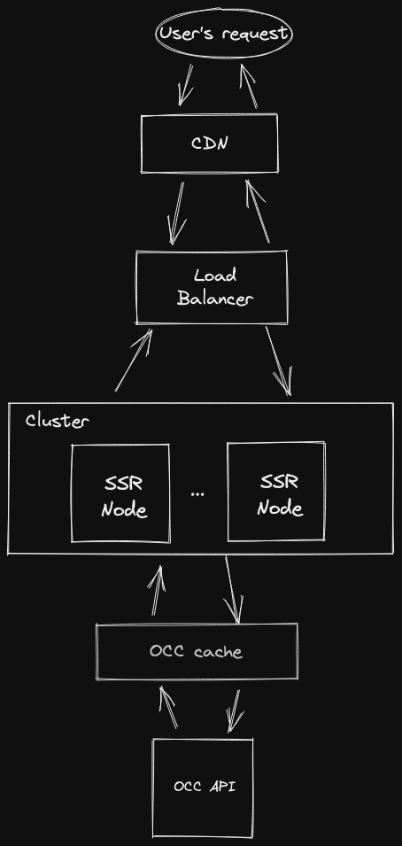

# Recommended SSR setup

This page describes the recommended setup when using SSR with Spartacus.
This may not be a perfect setup for every client, but it should cover most common requirements.

Below is a diagram which focuses only on the SSR piece of the whole system, and it shows a high-level typical flow from the start (user's request) to the end (OCC API server).

The flow is as follows:

1. The starting point is the User's request, typically issued from a browser.

1. The request should hit a caching layer (e.g. CDN), which might contain an already server-side rendered application, in which case the response is very quick.

   CDN typically stores the server-side renders for a certain period of time, depending on the business needs. After the given period, the cache is invalidated. To do this invalidation in an optimal way, it's recommended for CDN to ask for a fresh server-side render _before_ the cache is being evicted, and to continue serving the existing cache while the new render is being performed.

1. If the CDN doesn't have an SSR render cached, it forwards the request further, to a reverse-proxy (e.g. load balancer).

1. The reverse proxy (typically a load balancer) will decide to which SSR node (in a cluster of nodes) should it forward the request to.

1. An SSR node receives the request and starts the render. It issues OCC calls to the the OCC API.

   It is _not_ recommended to expose the SSR servers / nodes directly to the users, as the rendering is slow and will not meet the expected response times.

1. OCC API caching layer is responsible for caching the OCC API responses from the OCC API server. Generally, this means caching of GET and HEAD request's responses. If the OCC API caching layer has the response cached, it is returned immediately to the SSR node, without having the request reach the actual OCC API server, making it very fast for the SSR node to perform a render.

   It is recommended to setup some kind of a caching layer for the OCC API server, as this part takes the most time when server-side rendering.

1. If the OCC API caching layer does not contain a cached response for the given request, it forwards it to the OCC server for processing.
