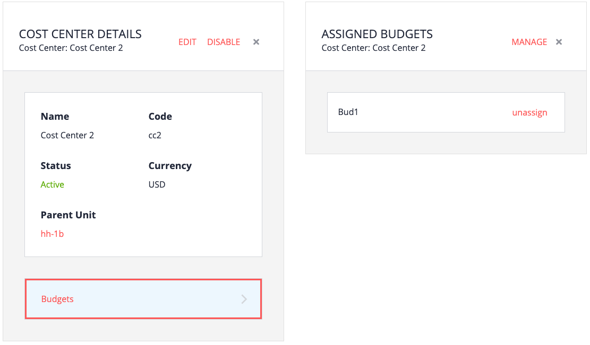

# Overview

A budget is used to limit spending for overall groups of people. Purchases count against budgets by being associated with cost centers. Buyers must select a cost center when checking out, so the purchase total is counted against that budget.

Budgets are not optional; an error will occur if a cost center is used without a corresponding budget. The same budget can be assigned to multiple cost centers.

# Creating a budget

1. From the My Company home page, click Budgets.

2. Click Add, and then fill in the required fields.

   - Name and Code
   - Start and end dates
   - Currency
   - Amount
   - Unit

Initially the budget is not assigned to any cost center.

# Assigning a budget to a cost center

1. From the My Company home page, click Cost Centers.

2. Select the cost center that will be assigned the budget.

3. Click Manage, then click Assign for the budget you want to assign.

4. Click Done.

In the following example, the budget Bud1 was assigned to Cost Center 2.

