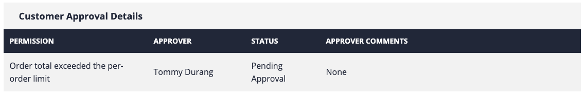
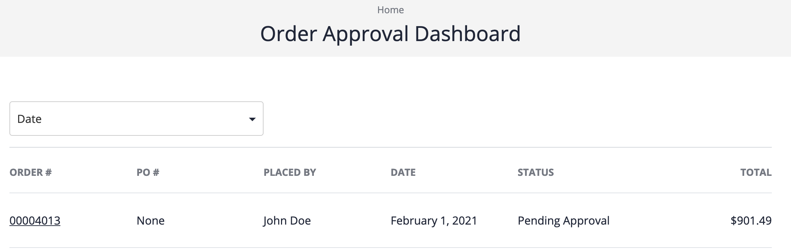
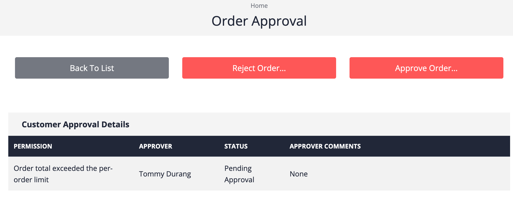
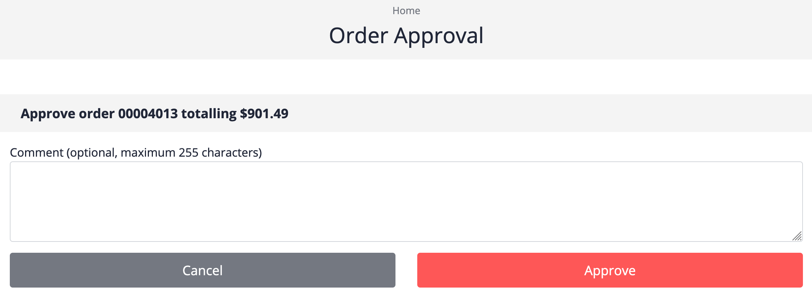
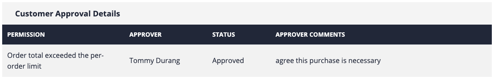

# Overview

The following example demonstrates use of the new buyer and approvers that were set up with your new organization.

# Purchase flow example with John Doe, new buyer

In this example, we'll purposely order something over the purchase limit, so we can see the Approval process in action.

1. In a separate browser, or using a private browser window, log in to the Powertools site as your buyer (in the case of this tutorial, John Doe is being used). 

   (If you try to log in using the same browser, you will lose the administrator browser session.)

2. Add products to the cart totalling over $500, and then start checkout.

   (The approval process will only be triggered if the purchase amount surpasses the purchase limits you created. In this tutorial, we created a per-order limit of $500 for the buyer.)

3. For payment method, select Account, and then click Continue.

4. Select a cost center and shipping address, and then click Continue.

5. Select a delivery mode, and then click Continue. The Review Order screen is displayed.

6. Select the terms and conditions check box, and then click Place Order.

# The order is now held

Because the order is over $500, the order is placed, but held for approval by the buyer's organization.

To see that an order is being held, display your order history. Wait a few moments for the backend to start the order flow. The order status starts out as "Created" but eventually you will see "Pending" and an approval table at the bottom of the order.

The reason why an order is held is displayed. In this case, the ordre was held because the total exceeded the per-order limit. You can also see who the approver is.

# Approving the order

To review the order, the approver that was created earlier in this tutorial must log on. You might want to do this in yet another browser so you can see the status of the order before and after approval.

1. Log in to Powertools as your approver (in the case of this tutorial, Tommy).

2. Click the My Account menu, and then click Approval Dashboard.

   The list of orders requiring approval is displayed.

   

3. Click the order number for the order requiring approval.

   The entire order is displayed, just like how the buyer sees it, but with the addition of an approval section at the top.

   

4. Click Approve Order. The Order Approval screen is displayed. 

   You can enter a comment if you wish. 
   
   To submit the approval, click Approve.

   

# The order can proceed

If John Doe checks the order after approval, he can see that the Approval table has been updated with the confirmation that the order was approved, with the comment. The same would appear if the order were rejected.

