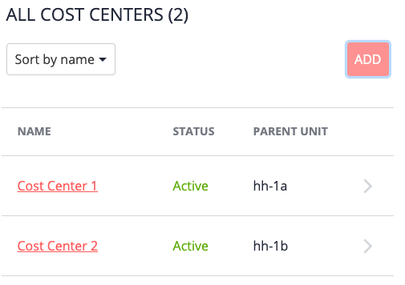
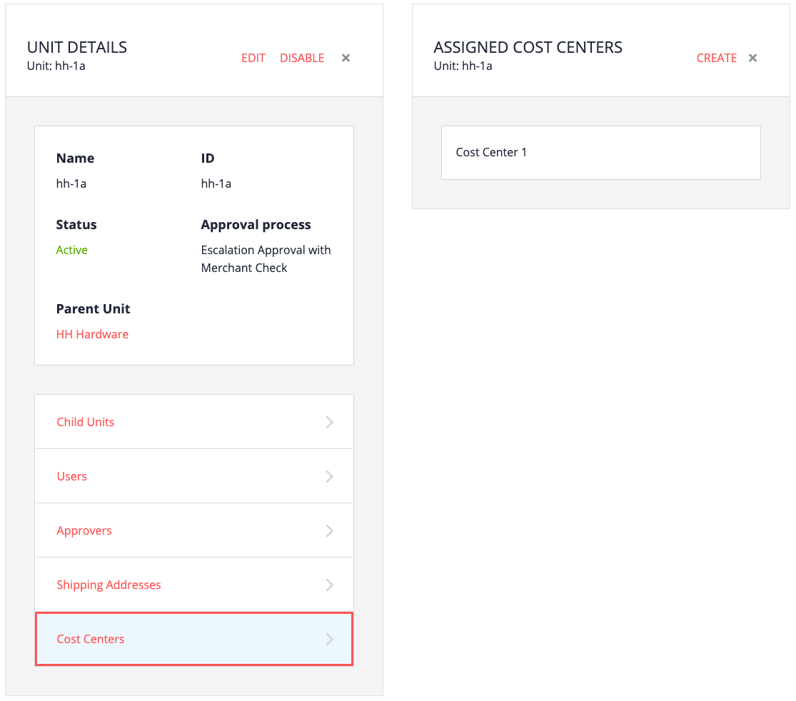
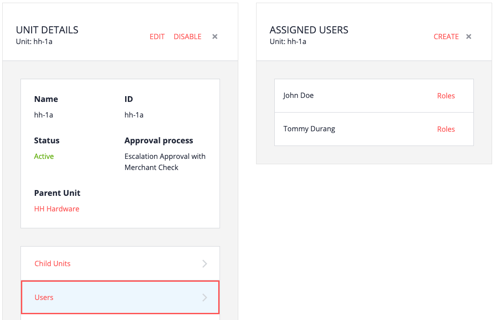

# Overview

A cost center is a simple entity meant for tracking purchases. A cost center can only be assigned to a single unit. Cost centers can be linked to multiple budgets, which are used for limiting spending in various ways.

A buyer selects a cost center during the B2B Store purchase flow, playing an important role for B2B Commerce Organization. For example:
- The shipping addresses available to the buyer depending on the cost center selected.
- The budget(s) the order applies against are selected through the choice of cost center.

# Creating a cost center

1. From the My Company home page, click Cost Centers.

2. Click Add, and then fill in the required fields.

   - Name and Code
   - Currency
   - Parent unit

In the following example, 2 new cost centers were created.

If you display the cost center information for your units, you will see that the cost center(s) are now associated with the units you chose when creating them.

Following the examples provided in this tutorial:
- The buyer assigned to unit hh-1a is John Doe
- The cost center assigned to unit hh-1a is Cost Center 1

Meaning: 
- Cost Center 1 (and not Cost Center 2) will be available to Mr. Doe during checkout.
- Mr. Doe will only be able to select shipping addresses from unit hh-1a.

