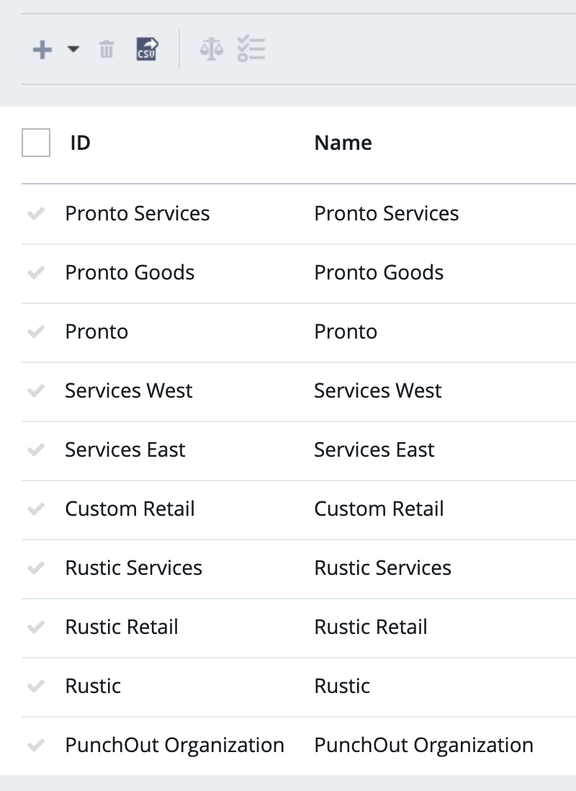
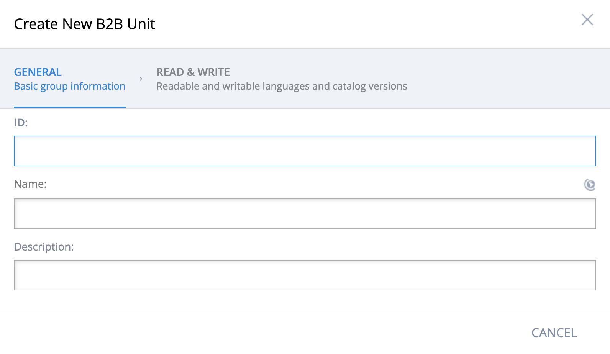
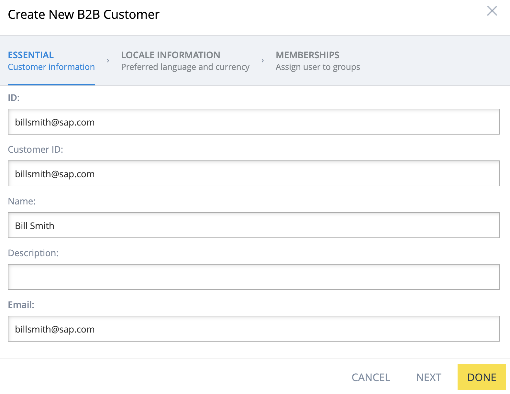
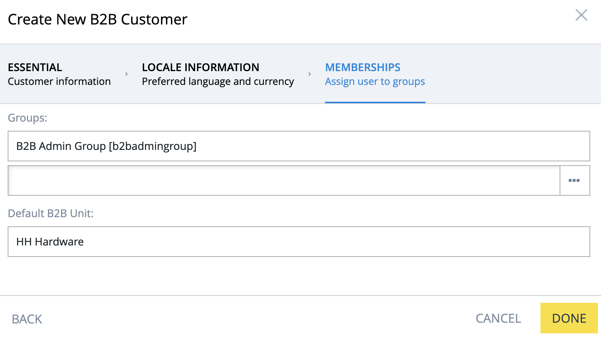
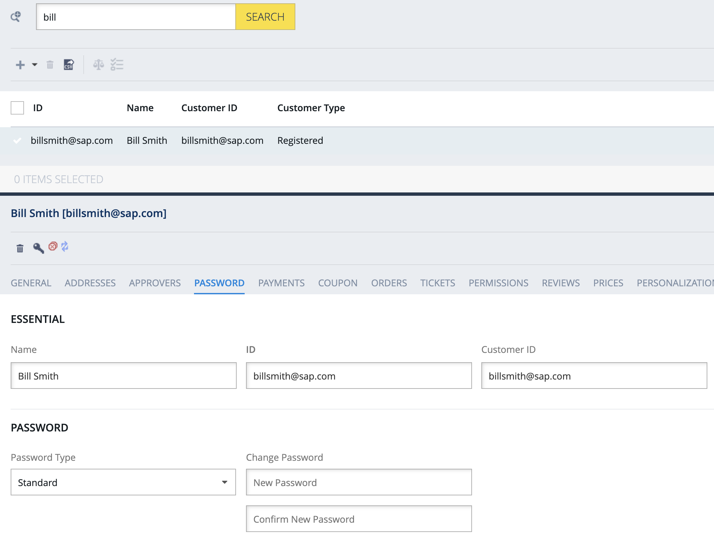
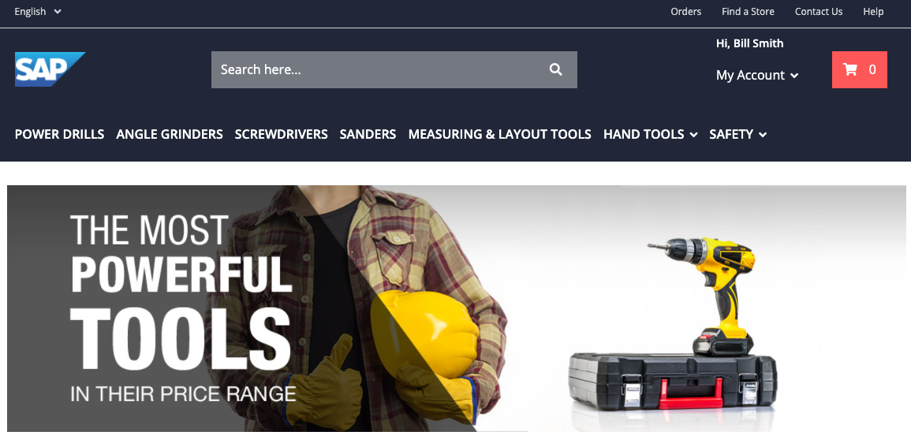
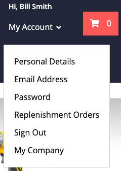
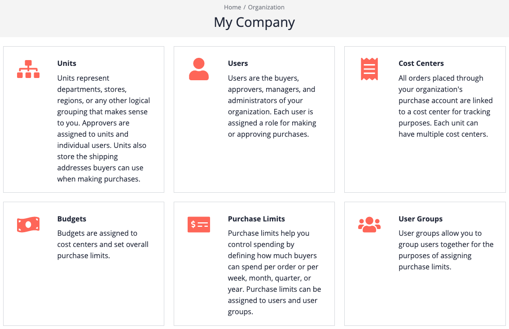

# Overview

For demonstration purposes during this tutorial, a new organization will be added to SAP Commerce Cloud Powertools store. If you wish, you can also use Linda Wolf and other users from Powertools sample data.

The out-of-the-box behavior of the Powertools sample store is to require a new buying company to request an account, either by filling in a registration form or by contacting the selling company to start a purchasing relationship. This process is often necessary as the selling company will collectively invoice the buying company for all purchases made by their employees, which usually requires contracts or informal agreements to do so.

Creation of a new buying organization along with a new administrator can be done with SAP Commerce Cloud Backoffice management tool. The top-level unit is known as the root unit. 

# Creating a new root unit for the buying company

1. Open the Backoffice tool. If you are working locally, you can access the tool through the following URL:

   https://localhost:9002/backoffice

2. At the login screen, enter "admin" as the username and the password for the administrator.

3. In the left navigation bar, scroll down to and then click B2B Commerce.

4. In the left navigation bar, under B2B Commerce, click B2B Unit. A list of existing units appears.

   

5. To create a new unit, click the Plus icon at the top of the list.

   The Create New B2B Unit window appears.

   

6. Type the ID and name of your unit, then click Done. The unit is created.

7. Click Search to refresh the list; your new unit should be visible.

# Creating the buying company's administrator for the new root unit

1. In the left navigation bar, under B2B Commerce, click B2B Customer. A list of existing B2B users appears. These users represent all roles of buying companies: administrators, buyers, approvers, and managers.

2. To create a new user, click the Plus icon at the top of the list.

   The Create New B2B Customer window appears.

3. Type the new user's email address into the ID, customer ID, and email fields. 

   Type the new user's name in to the Name field.

   

   Note: Although the customer ID is not required to create the user, it's important for proper handling of all users in Spartacus.

4. Click Next, and then Next again, so that the Memberships tab is displayed.

5. In the Groups field, add the group B2B Admin Group, and remove the B2B Customer Group.

   In the Default B2B Unit field, select the unit you created previously.

   

6. Click Done. The user is created but does not yet have a password.

7. Click Search to refresh the list; your new user should be visible. If not, enter the first few letters of your user in the search box, and click Search.

8. Select your new user, and then click the Password tab.

   

9. Type the user's password into the Change Password's New Password and Confirm New Password fields, and then click Save.

The user can now log in. Browse to your Powertools store and log on as the new user.

Since the user is the buying company's administrator, you should see My Company in the Account menu.

Clicking My Company displays the Commerce Organization home page.

You are now ready to create your commerce organization!
