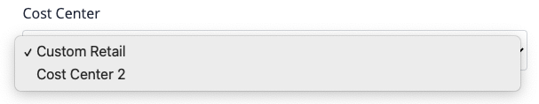
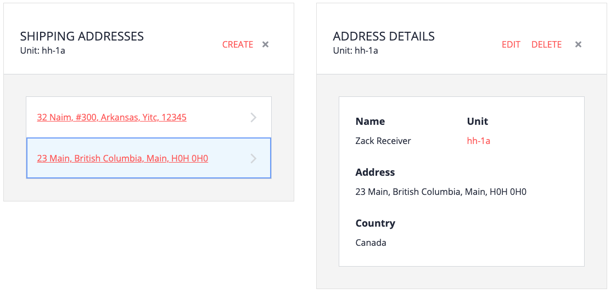

# Overview

When a buyer chooses to pay by Account, a cost center must be selected in order to check out. When a cost center is chosen, the available shipping addresses are the ones owned by the unit that the cost center is assigned to.

Shipping addresses are owned by units; there's no separate list of addresses, and addresses cannot be assigned to other units. At least one shipping address must be created or else the buyer cannot complete checkout.

# Creating a shipping address

1. From the My Company home page, click Units.

2. Select the unit to which want to add a new shipping addresses.

3. Click Shipping Addresses.

4. Click Create, and then fill in the required fields.
   - Country (affects display of states)
   - Title and name of shipping receiver
   - Address, city, state, postal code
   - Phone number

For the purposes of this tutorial, create at least 2 addresses.

# Deleting addresses

Unlike other Commerce Organization entities, shipping addresses can be deleted. Deleting an address does not affect orders that have already been placed, as the information is copied and made part of the order.
