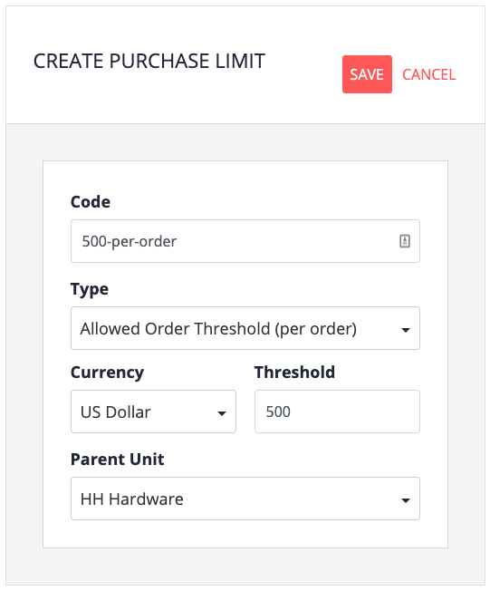
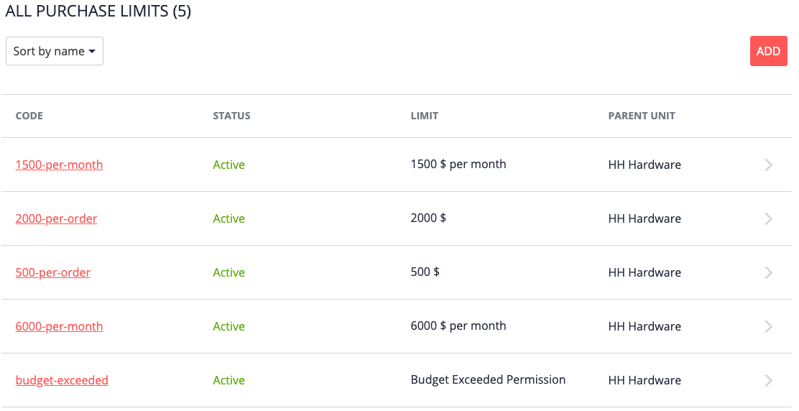
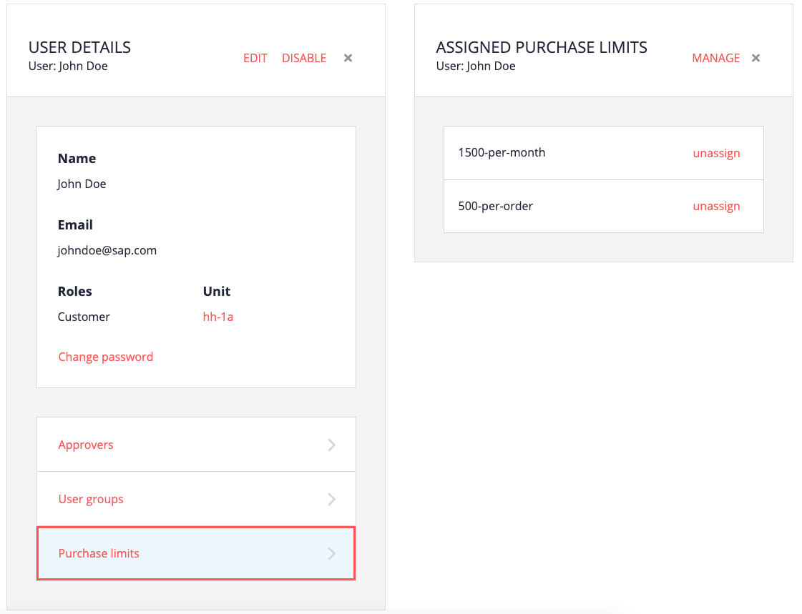

# Overview

Purchasing limits are assigned to individual users or to user groups. When an order placed by a buyer is below a limit, the order is automatically allowed to proceed through the seller's purchase flow. If it surpasses any of the limits, the order is placed but held until approval is given. If rejected, the order is cancelled.

# Types of purchasing limits

Three kinds of purchasing limits are provided out-of-the-box with SAP Commerce Cloud:
- Per order
- Per timespan (day, week, month, quarter, year)
- Budget exceeded (when a purchase surpasses the allocated budget but not necessarily per order or timespan)

A normal scenario might be that a standard approver can approve per-order and per-timespan orders, but perhaps "budget exceeded" is reserved for a higher-level purchasing manager.

# Creating a purchase limit

1. From the Commerce Organization Home page, click Purchase Limits.

2. Click Add, and then fill in the fields.
   - Code: However you want to identify the purchase limit)
   - Type: Per order, per timespan, budget exceeded
   - Period (if per timespan): Day, week, month, quarter, year
   - Currency (if per order or per timespan)
   - Threshold (if per order or per timespan): Amount after which approval is required
   - Parent unit: Doesn't have any effect on use of the purchase limit

   

5. Click Save.

# For this tutorial: create various purchase limits

For the purposes of this tutorial, create 5 purchase limits:
- $500 per order
- $2000 per order
- $1500 per month
- $6000 per month
- Budget exceeded

Assign them all to your root unit.

# Assigning purchase limits

To take effect, purchase limits must be assigned to users.

For this example, we'll assign 
- the two lower limits to the buyer
- the two higher limits to the approver
- the budget exceeded limit to the administrator (redundant as the administrator would get the approval request anyway)

To assign the buyer their purchase limits:

1. From the Commerce Organization Home page, click Users.

2. Click the buyer.

3. Click Purchase limits.

4. To the right of Assigned Purchase Limits, click Manage.

5. To the right of the limits you want to assign, click Assign, and then click Done.

   In the following example, our buyer John Doe (Customer role) has been assigned the both a per-month and a per-order limit.

   

Repeat this process for:
- The approver (the two larger per-order and per-timespan limits)
- The administrator (budget exceeded)

# Assigning the same purchase limit to multiple users

The User Groups feature was designed for grouping multiple users into one collection, with which you can assign spending limits all at once.

# In the absence of per-order or per-timespan

Buyers and approvers don't necessarily require both per-order and per-timespan purchase limits. For example, the following scenario is legitimate but perhaps sometimes unexpected:

- The buyer is assigned per-order limit of $500, but no per-timespan limit.
- The approver is assigned a per-order limit of $2000 and a per-timespan limit of $6000.
- The buyer makes a purchase of $200.
- The order is held for approval based on the per-timespan rule, because the absence of a per-timespan limit for the buyer is equal to $0 limit (meaning all orders are subject to approval).

This logic is controlled by SAP Commerce Cloud.