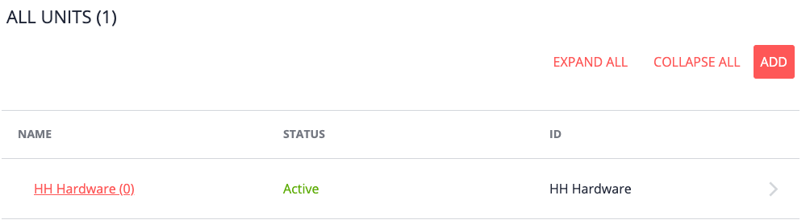
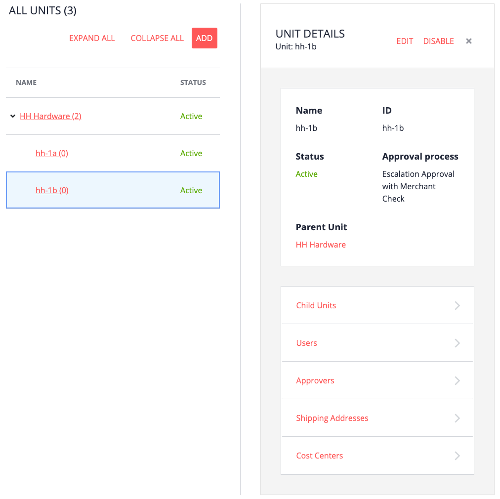

# Overview

A unit is the basic building block of the organization. A unit represents a department, location, region, or other entity that makes sense to you.

Units are the parents of, or are associated with, the following Commerce Organization entities:
- Child units
- Users
- Approvers
- Shipping addresses
- Cost centers

Each one is important in their own way.
- Units are inherited - a user assigned to a unit also has permissions for the child units.
- An approver assign to a unit potentially can approve any of the purchases made by buyers in the unit or in child units.
- The locations a buyer can ship to will depend on the shipping addresses created for a unit.
- The cost centers available to a buyer will depend on the unit or child units the buyer has access to. The shipping addresses available to a buyer will depend on the cost centers he or she can select.

# Creating a child unit

The following example starts off with a new unit and new administrator. No other units, shipping addresses, cost centers, etc. are defined.

As there must be one root unit, all new units are child units of another unit.

1. From the My Company home page, click Units.

   All units are displayed.

   

2. Click Add, and then fill in the required fields.

   - Name and ID
   - Approval Process: Defines the approval process used by the seller (not by your organization).
   - Parent unit

   In the following example, 2 new child units were created.

   

