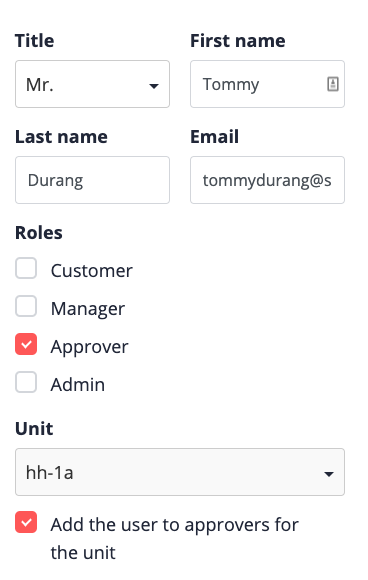
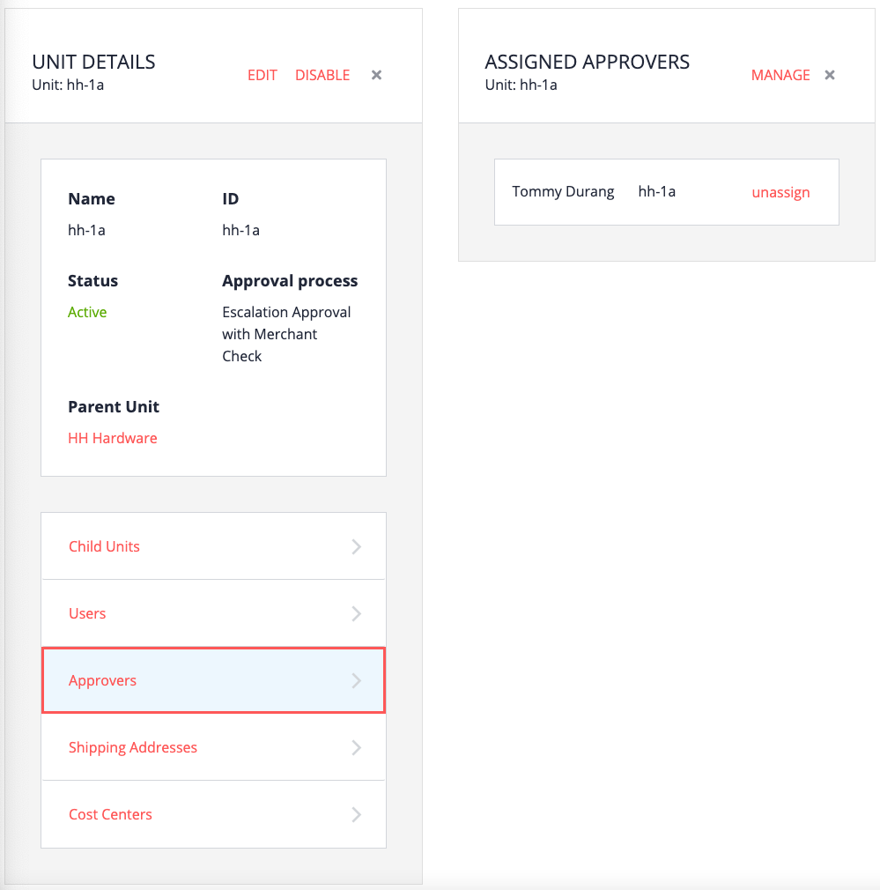

# Overview

The term "approver" is used in two different contexts in B2B Commerce Organization for SAP Commerce Cloud.

- The *role* of approver: The user is designated as someone who can perform order approvals, and not purchases). A user with role of approver is not necessarily the approver for the unit he or she is assigned to - that's a separate assignment.
- The *approver for a unit*: The user was added to the Approvers list for a unit - he or she is an official approver for anyone in that unit. 

(Buyers can also be assigned their own approver on an individual basis.)

In other words, for a user with role of approver belonging to a unit, that user isn't necessarily an approver for that unit. That user must be assigned to the Approver list for that unit as well. This is the default behavior when creating users with the role of Approver.

# Spending permissions required for approvers

Like buyers, approvers must also be assigned spending permissions. Not for the purposes of placing ordres, but forwhat they are allowed to approve. 

For example:
- A buyer may be assigned a spending limit of $500 per order and $1500 per month aggregate. If the buyer spends more money on an order, the order is placed but held until approval is granted.
- An approver may be assigned a "spending" (approval) limit of $10,000 per order and $30,000 per month aggregate.

# How approvers are chosen 

The choice of approval is a bubble-up method - when approval is required, SAP Commerce Cloud will go up through the unit hierarchy looking for an approver with the right combination of permissions and spending limits. 

If no approver is found, an administrator is chosen, ultimately arriving at the administrator of the root unit.

# Creating an approver

1. From the Commerce Organization Home page, click Units.

2. Select the unit the new approver will be assigned to.

3. Click Users.

4. Click Create, and then fill in the fields.
   - Title, first name, last name, email
   - Role: In this case, Approver
   - For this example, the unit is not selectable, as a user is being created within a unit
   - Add the user to approvers for the unit: Select this check box in order to automatically add the new approver as an approver for this unit (recall that just because a user has the role of approver, does not necessarily mean they are assigned the job of approving for a unit)

   

5. Click Save.

For the moment, this approver cannot approve anything. This is because no spending permissions have been created yet. We'll do that later on.

Don't forget to assign the new user a password.

# The Assigned Approvers list

Recall that when you created the approver, you selected the check box "Add the user to approvers for the unit". We created two users so far, and only one is an approver, so we should expect to see only one user in this unit's list of approvers.

If you go back and click Approvers for the unit, indeed that is the case.

   
