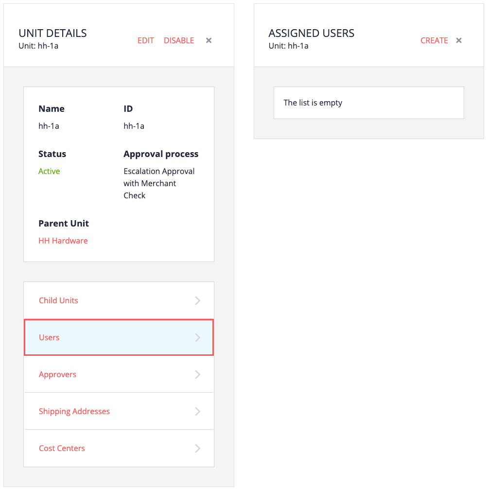
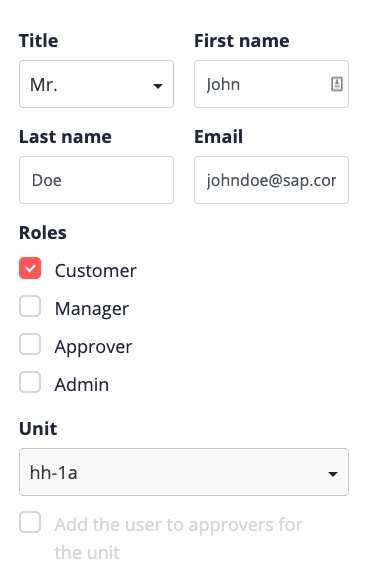

# Creating a buyer

1. From the Commerce Organization Home page, click Units.

2. Select the unit the new buyer will be assigned to.

3. Click Users. In this example, no users exist yet.

   

4. Click Create, and then fill in the fields.
   - Title, first name, last name, email
   - Role: In this case, Customer (buyer)
   - For this example, the unit is not selectable, as a user is being created within a unit

   

5. Click Save.

For the moment, all this user's purchases are subject to order approvals. This is because no spending permissions have been created yet. We'll do that later on.

# Assigning a password to the new user

New users are not given passwords by default. These users can choose to reset their password at first login, or you can assign a password.

To assign a password:

1. From the Commerce Organization Home page, click Users.

2. Select the user whose password you want to change.

3. Click Change password.

4. Type the new password in the two fields, and click Save.